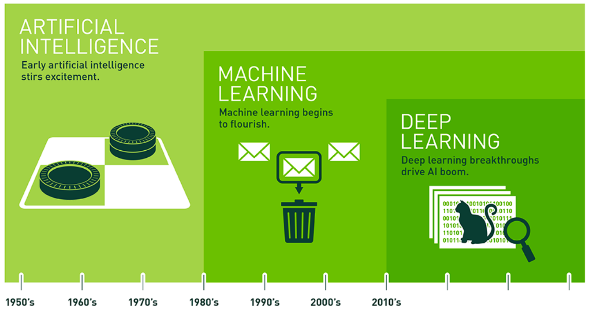
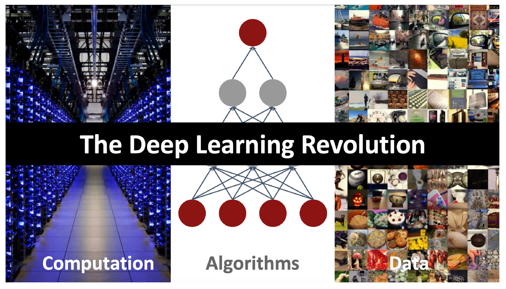
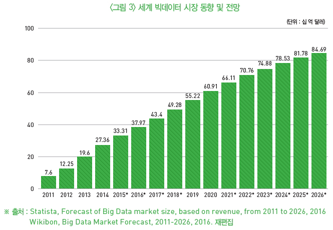
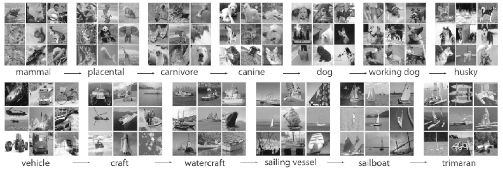
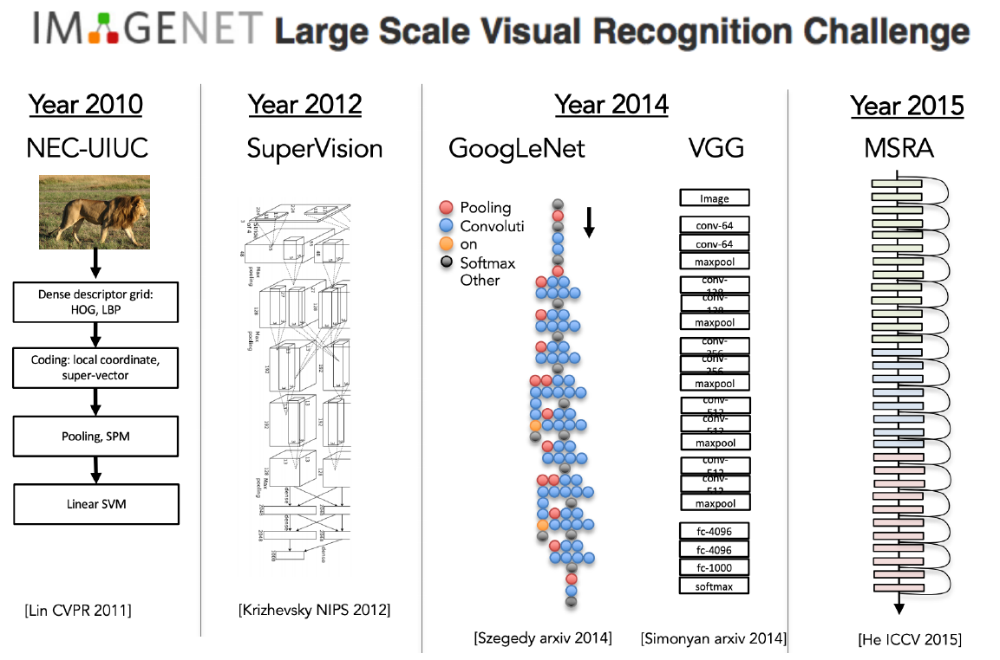
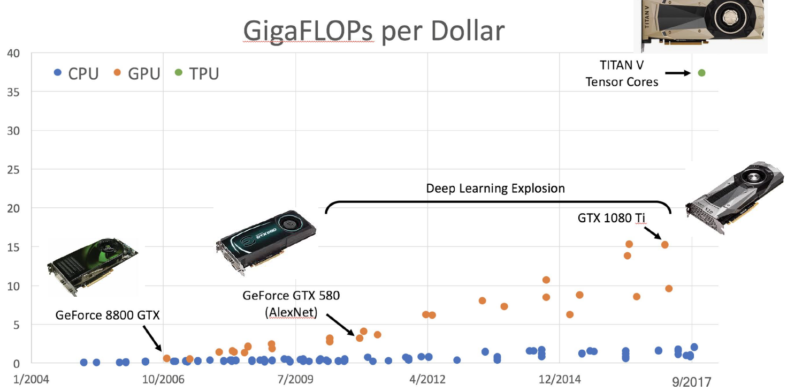
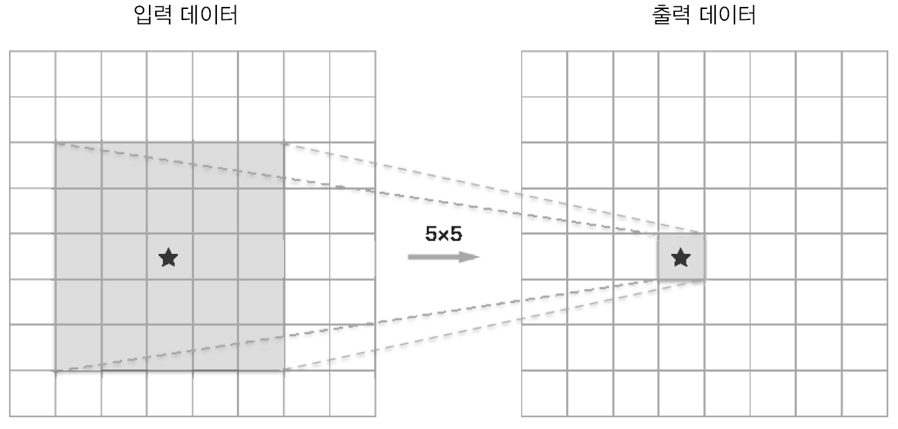
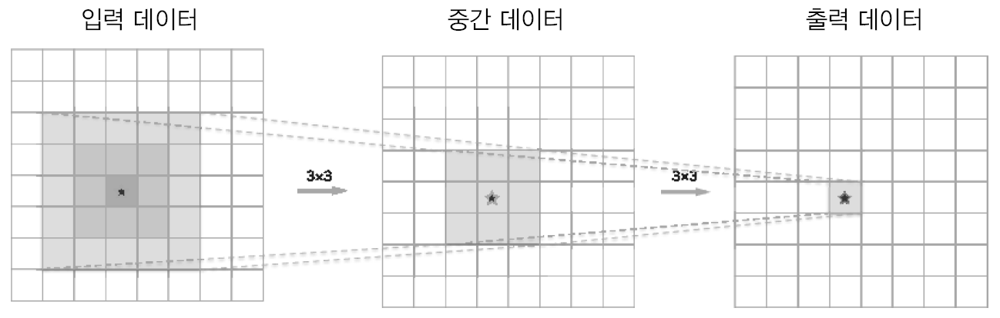

# Background

우선 딥러닝을 공부하기 전에 background를 공부하고, 현재 딥러닝의 한계점을 극복해나가는데 도움이 되기 위해 배경을 정리 하고자한다.

--------------

## 1. Ai vs Machine Learning vs Deep Learning

### 1-1. 정의

- Ai : 수학이나 생물학 같은 과학이다. 인간의 특권으로만 여겨져왔던 문제를 창의적으로 해결할 수 있는 지능형 프로그램과 기계를 만드는 방법을 연구하는 학문
- Machine Learning : 사전지식 없이 오로지 경험으로 발전하고, 자동으로 배우는 능력을 가진 시스템을 제공하는 방법을 말한다.
- Deep Learning : 사람의 신경망 시스템을 닮은 machine learning의 기법 중 하나이다.

-----------

## 2. 단점

딥러닝의 단점은 극명히 세가지로 나뉜다.

1. Data가 굉장히 많아야 한다.
2. 연산량이 굉장히 많다. --> 학습시간이 오래 걸린다.
3. 복잡한 구조를 가진다. --> 인간이 해석을 할수 없다.
4. 빈약한 이론
5. 해석이 힘들다.
6. 신뢰도 (confidence) 부족

--------------

## 3. Why?

그럼 딥러닝의 이러한 단점을 어떻게 극복했는가?

### 3-1. Data -> Internet & IOT의 발전

인터넷과 사물인터넷 시대가 펼쳐지면서 그로인해 생겨나는 데이터가 급속도로 생겨나기 시작했다. 

따라서 자동적으로 데이터가 급증했고, 이러한 동향이 Deep Learning의 고질적인 문제를 해결해주었다.

실제로 유명한 wordnet이나 imagenet 과 같은 dataset이 존재한다.

### 3-2. Algorithm -> 복잡한 Architecture 개발

Deep Learning의 단점 중 복잡한 알고리즘이었다. 

현재 알고리즘 부분에서는 굉장히 많이 개발된 상태이고, 앞으로 더 발전 가능성은 무궁무진하다.

### 3-3. Computation -> 하드웨어의 발전

Deep Learning의 단점 중 하나가 복잡하고 많은 연산량이었다. 복잡한 알고리즘 구조와 수많은 데이터를 학습해야하는 딥러닝은 하드웨어의 발전에 항상 막혀있었다. 

하지만, CPU와 메모리, GPU 등 하드웨어가 급속도로 발전함에 따라 이제 엄청난 연산량을 빠른 시간안에 해결할 수 있게 되었다.

-------

## 4. 장점

Deep Learning의 고질적인 문제를 해결하고 이제 장점을 간단히 얘기해보겠다.

1. 매개변수를 줄여 넓은 수용역을 소화할 수 있다.
2. 비선형함수로 활성화하여 복잡한 구조도 설명이 가능하다.
3. Deep 하게 쌓아서 정보를 계층적으로 전달 가능하고 복잡한 문제를 풀어나갈 수 있다.

### 4-1. 매개변수를 줄여 넓은 수용역을 소화할 수 있다.

우선 위의 첫 번째 그림처럼 5x5의 filter로 1개의 출력을 낼수 있다. 이 때 하나의 output을 내기 위해서 weight는 25개가 필요하다. 두 번째 그림에서는 3x3을 2번 연산한 경우이고, 이 때 weight는 2x3x3 = 18개가 필요하다.

> _**즉, 같은 input, 같은 output을 내는 신경망이 있더라도, layer를 Deep 하게 쌓으면 weight 갯수가 줄어들기 때문에 훨씬 효율적인 계산이 가능하다.**_

### 4-2. 비선형함수로 활성화하여 복잡한 구조도 설명이 가능하다.

[활성화함수를 왜 써야하는지?](03_neuralnetwork.md) 에 대한 대답은 이 파일을 보면 된다.

> _**즉, 비선형함수를 가지는 활성화함수를 적용해야 Deep하게 쌓은 이유가 존재한다.**_

### 4-3. Deep 하게 쌓아서 정보를 계층적으로 전달 가능하고 복잡한 문제를 풀어나갈 수 있다.

위의 그림을 보면 확실하게 이해가 된다. layer를 Deep하게 쌓았더니 처음에는 Edge와 Blob을 보는 layer, 2번째는 texture, 3번째는 객체인식을 보는 layer 가 존재하였다.

> _**즉, layer를 Deep 하게 쌓을수록 문제가 계층적으로 점점 세분화되어 해결하면서 각 layer에서 담당하는 문제가 점점 단순화된다. 또한 각각의 layer들도 단순화해서 문제를 보기 떄문에 효율적인 학습이 가능하다.**_

## 5. 풀어가야할 숙제

1. 빈약한 이론
2. 해석이 힘들다.
3. 신뢰도 (confidence) 부족
