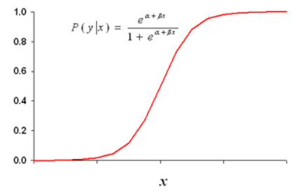
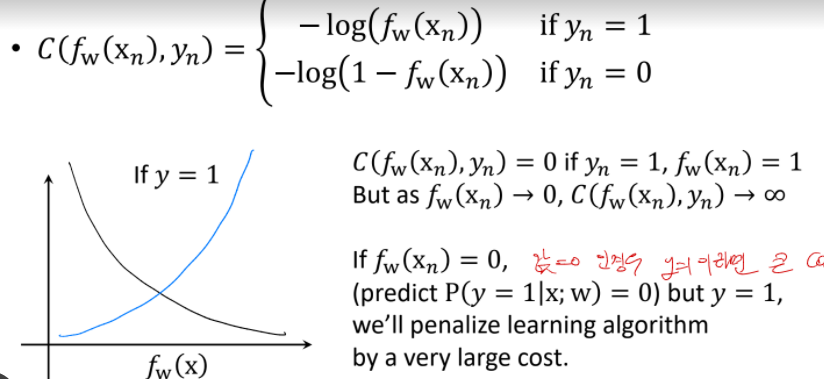

# Logistic Regression

## 1. 독립변수 1개인 logistic Regression

p = (독립변수 X가 성공할 확률) = $p(y|x)$

$$log(\frac{P}{1-P}) = WX + b$$
$$\frac{P}{1-P} = e^{WX + b}$$
$$P = \frac{e^{WX + b}}{1+e^{WX + b}}$$

sigmoid 형태가 만들어진다.

> 따라서 sigmoid 식에 $WX+b$를 넣어주면 binary classification이 가능하다.

## 2. Loss Function : Binary Cross Entropy

$$L(w) = [-y_n log(f_w(x_n))-(1 - y_n)log(1 - f_w(x_n))]$$

사실 binary loss function에서는 $y_n$이 생략되어있다. 여기서 $y_n$은 참이냐 거짓이냐를 말하는 1,0 이다.