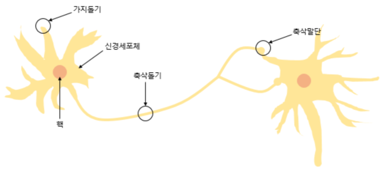

# 퍼셉트론 (Perceptron)

## 신경세포

> 1950년대 과학자들은 신경세포인 뉴런의 동작원리를 알아냈습니다. 뉴런은 가지돌기 또는 수상돌기에서 여러 신호들을 받아들이고, 축삭돌기를 통해 전기 신호를 다음 뉴런으로 전달합니다. 뉴런은 들어오는 신호들의 합이 임계치가 넘어가면 시냅스를 통해 전기신호를 전달합니다. 이처럼 뇌는 1천억 개의 뉴런과 100조 개의 연결이 존재하는 생물학적 네트워크이다.   

## 퍼셉트론 (Perceptron)

우리는 여기서 뉴런의 동작원리를 잘 보고 퍼셉트론이 어떤 개념을 차용했는지 보아야 한다. 

1. 뉴런에서 가지돌기 및 수상돌기에서 여러 signal을 받아들인다고 한 부분은 $x_1,x_2...x_n$ 에 해당하는 __*input*__ 들이다.
2. 축삭돌기에 해당하는 부분은 $w_1,w_2....w_n$ 을 의미하는 __*weight*__ 이다.
3. signal들이 축삭돌기들을 거치면서 하나로 합쳐진다. 이 부분은 그림에서 __*Σ*__ 부분이다.
4. 축삭돌기를 거친 signal들이 일정 임계치가 넘어가면 시냅스로 전달된다고 한 부분은 그림에서 계단모양을 가지는 그림, __*activation function*__ 이다.  singal들의 일정 임계치가 도달하지 않으면 다음 뉴런으로 전달되지 않고, 일정 임계치를 넘어가면 다음 뉴런으로 전달된다. 이 부분은 그림에서 0 아니면 1로 바꿔주는 __*activation function*__ 을 의미하며, 0은 신호 전달이 되지 않고, 1은 신호 전달이 되는 것을 의미한다.

### 퍼셉트론 식

## 논리회로

### 1. AND gate

퍼셉트론 식을 떠올려보면 $w_1x_1 + w_2x_2 + .... w_nx_n +c$ 의 형태를 가진다.  
AND gate를 만족하는 매개변수 $w_i$ 들은 무한대에 가깝다.

### 2. OR gate

### 3. NAND gate

####  *__같은 퍼셉트론 구조를 가지지만, weight만 조절하는데도 각자 다른 문제들을 해결한다.__*

### 4. XOR gate

위에서 AND, OR, NAND 모두 퍼셉트론 하나로 표현이 가능하였다.
그렇다면 *__XOR 도 퍼셉트론 하나로 문제를 풀 수 있는가?__* 그에 대한 *__답은 불가능이다.__*
퍼셉트론은 기본적으로 linear한 공식으로 되어있다. 따라서 그림처럼 linear한 퍼셉트론으로 문제를 해결하려면 퍼셉트론을 2개 쓰지 않는 이상, XOR 문제를 절대 풀 수 없다.

## MLP (Multi-Layer Perceptron)

*__그렇다면 하나의 이어지는 선, 즉 하나의 구조 퍼셉트론 (단층 x)으로 어떻게 XOR 문제를 풀 것인가?__*

이1와 같은 모식도를 가지는 단계를 만들면 된다. 
NAND 처리하는 와 OR 처라하는 layer를 두 개 놓고 이들의 결과를 다시 AND를 통과시키면 아래와 같은 table에 의해 XOR gate가 만들어진다.

#### 즉, 우리는 여기서 퍼셉트론이 의미하는 것을 다시 한 번 살펴봐야한다.
   
   1. 여러 개의 input을 받고 계단함수를 거쳐 하나의 y를 뱉어내는 퍼셉트론은 weight들로 x에 대한 linear한 관계로 y를 예측한다.
   2. 이러한 퍼셉트론을 여러 개로 중첩해서, 즉, MLP를 구성한다면, 계단함수를 여러번 거쳐 non-linearty가 증가하여 x에 대한 non-linear한 관계로 y를 예측할 수 있다.

그래서 실제로 MLP로 XOR gate를 구성하였을 때, 퍼셉트론이 가지는 function은 여러 layer를 통과하여 다음과 같이 non-linear 한 구조로 나온다.

### 다중퍼셉트론의 의미
**은닉 뉴런들이 각 입력의 값에 의존하고 있기 때문에 신경망은 입력들 사이의 복잡한 상호 작용을 설명할 수 있다.**
다층 퍼셉트론, 즉 **신경망이 보편적인 approximator라는 것이 잘 알려져 있다.** 이것의 의미는 다음과 같다. 
한 개의 은닉층을 갖는 다층 신경망이라도, 충분히 많은 노드와, 정확한 가중치를 설정할 수 있다면 모든 함수에 대한 모델을 만들 수 있다는 것이다. 사실 여러 개의 layer를 쌓는 함수보다 단층인 함수를 학습하는 것은 매우 어려운 부분이다. 그리고, 더 깊은 (또는 더 넓은) 뉴럴 네트워크를 이용한다면, 예측하기 굉장히 힘들고 불가능에 가깝기 때문에 함수를 더욱 더 간결하게 추정할 수도 있다.