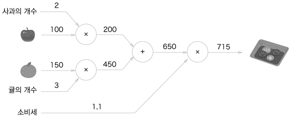
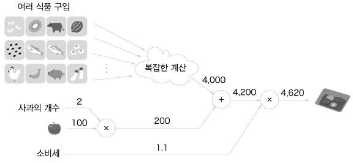
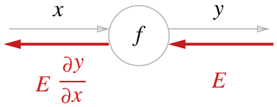
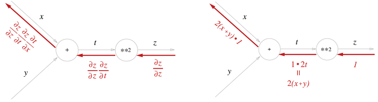
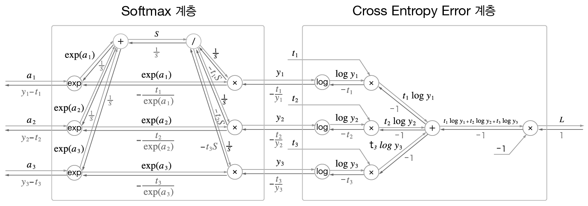

# 오차역전파법 (Backpropagation)

## 정의 및 목적

앞서서 Loss Function을 학습시킬 때, 우리는 신경망의 weight의 기울기에 수치미분을 적용하였다.

수치 미분은 단순하고 구현하기도 쉬운 장점이 있다.
하지만 계산시간이 오래걸린다는 단점이 존재한다.

이번 챕터에서는 weight를 효율적으로 계산하는 방법인 Backpropagation을 공부하자.

-------------

## 1. 계산 그래프

계산 그래프는 계산과정을 그래프로 표현한 것이다. 굉장히 직관적이며, 처음에는 신경망의 연산과 변화율에 대한 연관성을 캐치하기 쉽다.

위의 그래프에서 input은 사과의 개수, 귤의 개수를 의미한다. 또한 weight는 사과의 가격, 귤의 가격, 소비세 들을 말한다.

### 1.1 Why?, 왜 계산그래프를 써야할까?

위의 문제를 정의해보면, _**사과의 가격, 귤의 가격, 소비세는 총 가격에 어느정도로 영향을 끼칠까?**_ 하는 것이 우리가 가지는 궁금한 질문이다.

실제로 각 weight들이 loss에 어느정도로 영향을 끼치느냐에 따라 많이 영향을 끼친다면 그 weight값을 많이 조절하고, 적게 영향을 끼친다면, 적게 조절하는 등 weight들을 수치미분을 적용하여 우리의 모델을 최적화 시킬 수 있다.

### 1.2 When? 언제 쓰는것이 제일 효과적일까?

1. **"국소적인 계산"** 으로 문제를 정의하여 문제를 단순화, _**자신과 관계된 정보만을 결과로 출력할 수 있다는 것**_ 이 장점이다. 아무리 복잡하더라도 계산그래프를 이용한다면, 쉽게 weitght들이 output에 얼마나 영향을 끼치는지 볼 수 있다.
2. Backpropagation을 이용하여 미분을 효율적으로 사용가능하다.

-------------

## 2. Chain Rule

### 2.1 정의

> 합성함수의 미분은, 합성함수를 구성하는 각각의 함수를 미분한 값을 곱한 값과 일치한다.

### 2.2 방법

$x, t, z$ 는 각각 node에서 출발한 값들이다. t는 $x+y$, z는 $(x+y)^2$.

$\frac{\partial{z}}{\partial{z}}, \frac{\partial{z}}{\partial{t}}, \frac{\partial{t}}{\partial{z}}$ 를 이용하여 각각의 $z$에 대한 $x, t$의 변화율을 구한 그래프이다.

**즉, chain rule에 의해 국소적인 미분값을 구해도, 전체에 대한 미분값이 구해진다.**

-------------

## 3. Activation Function

### 3-1. ReLU

1. $x>0 : x, \frac{\partial{y}}{\partial{x}} = 1$
2. $x<0 : 0, \frac{\partial{y}}{\partial{x}} = 0$

### 3-2. Sigmoid

1. $y = \frac{1}{(1+e^{-x})}$
2. $\frac{\partial{y}}{\partial{x}} = (1-g(x))g(x), g(x)=\frac{1}{(1+e^{-x})}$

### 3-3. Affine

> 신경망의 forward 일 때, 수행하는 행렬의 곱은 Affine Transformation이라고 한다.

지금까지의 계산 그래프는 스칼라 값만 다뤘지만, Affine은 행렬이 흐르고 있다.

### 3-4. Softmax & Cross Entropy

#### 1) Entropy

$$H(x)=−\sum_{i=1}^{n}  p(x_i) log{p(x_i)}$$

> 엔트로피는 불확실성의 척도이다.

따라서 Deep Learning에서 말하는 _**엔트로피는 어떤 데이터가 나올지 모르는 불확실성**_ 이라고 이해하면 된다.

#### 2) cross entropy

$$H(x)=−\sum_{i=1}^{n}  q(x_i) log{p(x_i)}$$

> cross entropy는 실제값과 예측값의 차를 줄이려고 하는 엔트로피

위의 그림 첫 번째는 softmax 계층을 거쳐서 예측값이 확률로 나온 그림이고,
두 번째는 cross entropy error 계층을 거쳐서 Loss Function을 업데이트 하는 과정이다.

cross entropy 계층을 보면, $t$는 class label이고, $y$는 softmax에서 예측한 확률이다. 

원래의 엔트로피는 예측한 $y\log{y}$ 이지만, _**cross entropy는 $t\log{y}$ 로써, class label을 softmax의 output과 곱한다.**_

_**만약 실제로 정답이었던 값의 확률이 0에 근접하게 나온다면, $t\log{y}$, 즉 loss 값은 매우 커질 것이다. 따라서 업데이트 되는 기울기 폭도 증가할 것이다. 만약 정답이었던 값의 확률이 1에 근접하게 나온다면 0에 수렴하게되므로, 업데이트 되는 기울기 폭도 줄어들 것이다.**_

> 즉, cross entropy는 _**classify 뿐만 아니라, 잘 예측하여도 실제값과 예측값의 차이를 주어 모델을 더 완벽하게 할 수 있는 Loss Function**_ 이다.

#### 3) cross entropy & binary cross entropy

$$H(x)=−\sum_{i=1}^{n}  q(x_i) log{p(x_i)}$$
cross entropy는 실제값과 예측값의 차를 줄이려고 하는 엔트로피
$$H(x)=t\log{y} + (1-t)\log{(1-y)}$$
binary cross entropy는 binary 일 때만 가능하다.

사실 식이 똑같으므로, binary cross entropy 말고, 그냥 cross entropy라고 하면 된다.

#### 4) Backpropagation

_**softmax 와 cross entropy의 업데이트 되는 값을 보면 $y-t$이다.**_

되게 중요한 부분이니 알아두자.

------------

## 4. Backpropagation 증명

## Reference 

1. [Softmax Backpropagation](https://ratsgo.github.io/deep%20learning/2017/10/02/softmax/)