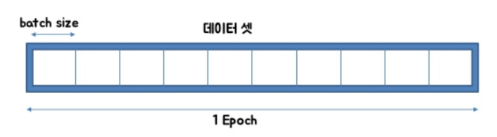
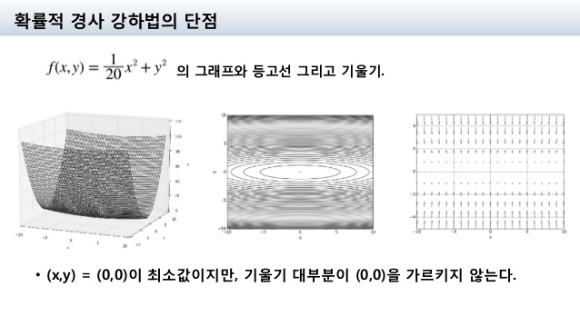
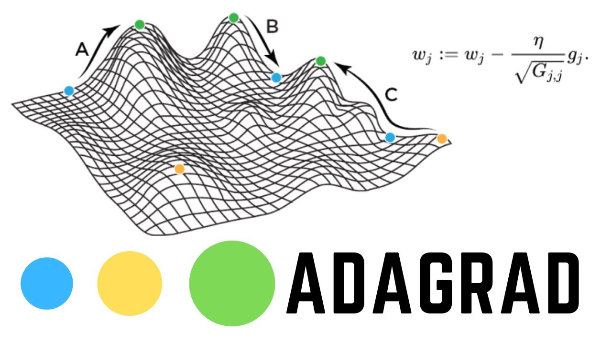
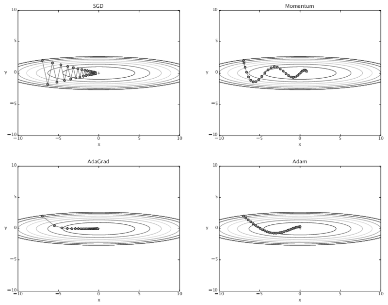

# Optimizer

## 1. 용어정리

### epoch, batch, iteration, mini-batch

- epoch : 전체 dataset 하나를 한 번 학습하는 횟수
- batch : 전체 dataset을 n개의 size를 가지는 dataset으로 나누는 size의 크기
- iteration : 전체 dataset을 batch-size로 나누면서 생기는 batch들의 갯수
- mini-batch : dataset을 batch size로 쪼개서 학습한다는 의미

## 2. BGD (Batch) & SGD (Stochastic)

[$\boldsymbol{w}_{new} = \boldsymbol{w}_{old} - \eta \nabla \boldsymbol{w}_{old}$](https://latex.codecogs.com/svg.latex) 

위의 parameter들을 업데이트하는 개념은 동일하다.

#### 2-1) 정의

- BGD : 한 epoch이던, 한 batch이던 전체 데이터를 보고 update를 한다.
- SGD : 전체 데이터가 아니라, 개별 mini-batch 하나하나씩을 본다.

#### 2-2) 장단점

##### BGD

- 장점
  - 좀 더 정확하게 global minimum에 접근이 가능하다.
  - 불필요한 계산이 많지 않다.
- 단점
  - 시간이 오래걸린다. cost가 크다.
  - local minimum에서 벗어나기 어렵다.

##### SGD

- 장점
  - 계산 시간이 굉장히 빠르다. 같은 시간안에 많은 iteration이 가능하다.
  - local minimum에서 벗어나기 BGD보다 상대적으로 쉽다.

- 단점
  - 위의 그림에 최소점은 (0,0)인데 (-2,0), (-1,0), (3,0) 같은 지점에서는 기울기가 0에 가깝게 된다. 따라서 (n,0) 지점에 있는 수들은 (0,0)으로 가지 않는다. 
  - 수렴 방향이 중구난방이다.
  - global minimum으로 가는데까지 시간이 좀 오래 걸린다.
  - 비등방성 함수 (방향에 따라 성질이 달라지는 함수) 에서는 비효율적이다. (e.g. $z= x^2 + y^2$)

## 3. Momentum

> Momentum은 운동량이다. 즉, 운동량이 센 지역으로 기울기를 더 가중한다.

$$v_t = \gamma v_{t-1} + \eta \nabla_{w}L(w)$$ 
$$W_{t+1} = W_t + v_t$$ 

- $\eta$ : learning rate (hyperparameter)
- $\gamma$ : (hyperparameter)
- $v$ : 속도
- $L$ : loss function

그대로 해석해보면, 속도는 전의 position에서의 v와 Loss function의 기울기의 비례한다. 여기서 _**전의 position에서의 속도를 중요시한다는 점이 포인트다.**_

γ 는 얼마나 momentum을 줄 것인지에 대한 momentum term으로서, 보통 0.9 정도의 값을 사용한다

### 장 단점

- 장점
  - local minimum에서 빠져나오기 쉽다.
- 단점
  - 전의 position에서의 변수들을 기억해야하기 때문에, 연산할 때 메모리가 두배로 든다는 단점이 존재한다.
  - global minimum에서 빠져나와 발산할 수도 있다.

## 4. Nesterov Accelerated Gradient (NAG)

> 운동량만큼 갔다는 가정하게 다음 step을 생각한다.

$$v_t = \gamma v_{t-1}+ \eta\nabla_{w}L(w-\gamma v_{t-1})$$ 
$$W_{t+1} = W_t - v_t$$ 

- $\eta$ : learning rate (hyperparameter)
- $\gamma$ : (hyperparameter)
- $v$ : 속도
- $L$ : loss function

Momentum 방식에서는 이동 벡터 $v_t$ 를 계산할 때 현재 위치에서의 gradient와 momentum step을 독립적으로 계산하고 합친다. 

반면, NAG에서는 momentum step을 먼저 고려하여, momentum step을 먼저 이동했다고 생각한 후 그 자리에서의 gradient를 구해서 gradient step을 이동한다.

#### 장, 단점

- 장점
  - local minimum에서 빠져나오기 쉽다.
  - Momentum 방식에 비해 보다 효과적으로 이동할 수 있다. 
  모멘텀으로 이동을 반정도 한 후 어떤 방식으로 이동해야할 지를 결정한다. 따라서 Momentum 방식의 빠른 이동에 대한 이점은 누리면서도, 멈춰야 할 적절한 시점에서 제동을 거는 데에 훨씬 용이하다고 생각할 수 있을 것이다.
- 단점
  - 전의 position에서의 변수들을 기억해야하기 때문에, 연산할 때 메모리가 두배로 든다는 단점이 존재한다.
  - global minimum에서 빠져나와 발산할 수도 있다. 

## 5. Adagrad

> 변수들을 update할 때 각각의 변수마다 step size를 다르게 설정해서 이동하는 방식이다. 
> 
> 지금까지 많이 변화하지 않은 변수들은 step size를 크게 하고, 지금까지 많이 변화했던 변수들은 step size를 작게 하자

$$G_{t} = G_{t-1} + (\nabla_{w}L(w_t))^2$$ 
$$w_{t+1} = w_t - \frac{\eta}{\sqrt{G_t + \epsilon}} \cdot \nabla_{w}L(w_t)$$ 

- $\eta$ : learning rate (hyperparameter)
- $G$ : Neural Network의 parameter가 k개라고 할 때 k차원 벡터, "time step t"까지 각 변수가 이동한 gradient의 sum of squares 를 저장한다
- $L$ : loss function
- $\epsilon$ : (hyperparameter)

자주 등장하거나 변화를 많이 한 변수들의 경우 optimum에 가까이 있을 확률이 높기 때문에 작은 크기로 이동하면서 세밀한 값을 조정하고, (G값이 커져서 기울기 폭이 작기 때문에)

적게 변화한 변수들은 optimum 값에 도달하기 위해서는 많이 이동해야할 확률이 높기 때문에 먼저 빠르게 loss 값을 줄이는 방향으로 이동하려는 방식이라고 생각할 수 있겠다. 

#### 장, 단점

- 장점
  - _**word2vec이나 GloVe 같이 word representation을 학습시킬 경우,**_ 단어의 등장 확률에 따라 variable의 사용 비율이 확연하게 차이나기 때문에 Adagrad가 Good!
  - 학습을 진행하면서 굳이 step size decay등을 신경써주지 않아도 된다는 장점이 있다. 보통 adagrad에서 step size로는 0.01 정도를 사용한 뒤, 그 이후로는 바꾸지 않는다. 
- 단점
  - Adagrad에는 학습을 계속 진행하면 step size가 너무 줄어든다는 문제점이 있다. 
  - G에는 계속 제곱한 값을 넣어주기 때문에 G의 값들은 계속해서 증가하기 때문에, 학습이 오래 진행될 경우 step size가 너무 작아져서 결국 거의 움직이지 않게 된다. 

## 6. RMSProp

> 변수들을 update할 때 각각의 변수마다 step size를 다르게 설정해서 이동하는 방식이다. 
> 
> 지금까지 많이 변화하지 않은 변수들은 step size를 크게 하고, 지금까지 많이 변화했던 변수들은 step size를 작게 하자

$$G = \gamma G + (1-\gamma)(\nabla_{w}L(w_t))^2$$ 
$$W = W - \frac{\eta}{\sqrt{G + \epsilon}} \cdot \nabla_{w}L(w_t)$$ 

- $\eta$ : learning rate (hyperparameter)
- $G$ : Neural Network의 parameter가 k개라고 할 때 k차원 벡터, "time step t"까지 각 변수가 이동한 gradient의 sum of squares 를 저장한다
- $L$ : loss function
- $\epsilon$ : (hyperparameter)
- $\gamma$ : hyperparameter

Adagrad의 식에서 gradient의 제곱값을 더해나가면서 구한 Gt 부분을 합이 아니라 지수평균으로 바꾸어서 대체한 방법이다.

## 7. Adam

> Adam (Adaptive Moment Estimation)은 RMSProp과 Momentum 방식을 합친 것 같은 알고리즘이다. 
> 
> 이 방식에서는 Momentum 방식과 유사하게 지금까지 계산해온 기울기의 지수평균을 저장하며, RMSProp과 유사하게 기울기의 제곱값의 지수평균을 저장한다.

$$m_t=β_1m_{t−1}+(1−β_1)∇_wL(w)$$
$$v_t=β_2v_{t−1}+(1−β_2)(∇_wL(w))^2$$

다만, Adam에서는 $m$과 $v$가 처음에 0으로 초기화되어 있기 때문에 학습의 초반부에서는 mt,vt가 0에 가깝게 bias 되어있을 것이라고 판단하여 이를 unbiased 하게 만들어주는 작업을 거친다.

$m_t$ 와 $v_t$의 식을 ∑ 형태로 펼친 후, 양변에 expectation을 씌워서 정리해보면, 다음과 같은 보정을 통해 unbiased 된 expectation을 얻을 수 있다. 이 보정된 expectation들을 가지고 gradient가 들어갈 자리에 $\hat{m_t}$, $G_t$가 들어갈 자리에 $\hat{v_t}$를 넣어 계산을 진행한다.

$$\hat{m_t}=\frac{m_{t}}{1−β^{t}_{1}}$$
$$\hat{v_t}=\frac{v_{t}}{1−β^{t}_{2}}$$
$$w_{t+1}=w_{t}−\frac{η}{\sqrt{\hat{v_t}+ϵ}}\hat{m_t}$$
보통 $β_1$ 로는 0.9, $β_2$ 로는 0.999, $ϵ$ 으로는 10−8 정도의 값을 사용한다고 한다.

위의 그림은 SGD, Momentum, Adagrad, Adam을 비교한 그림이다.

## 8. Optimizer Visualization

