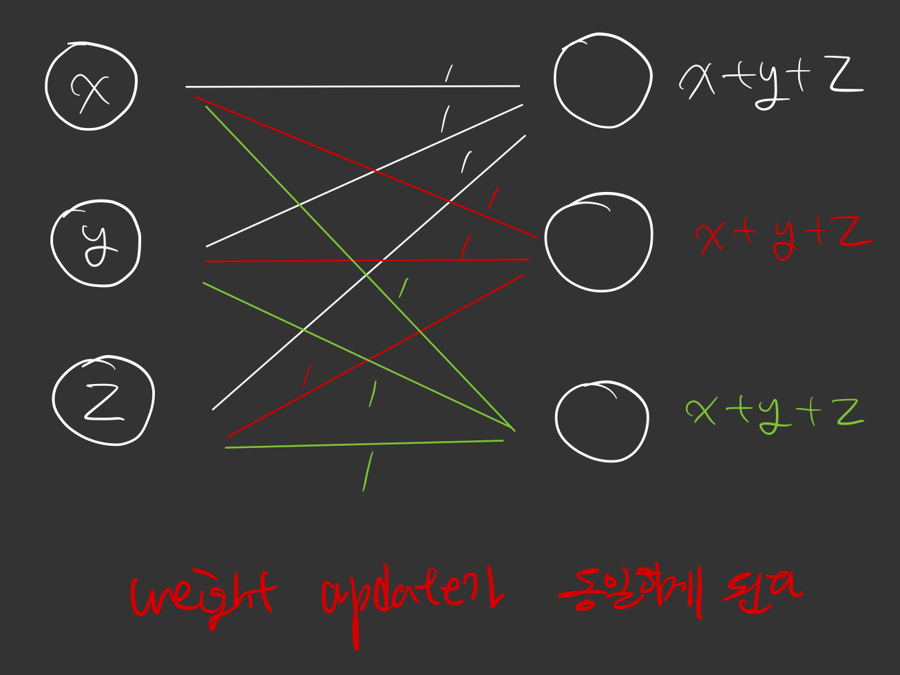
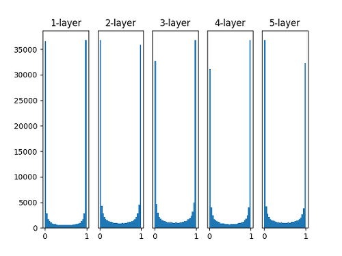
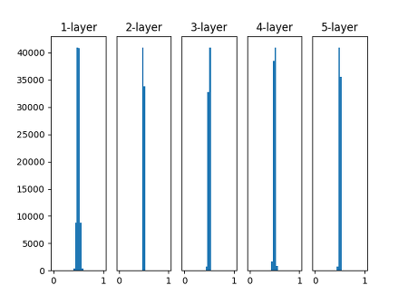
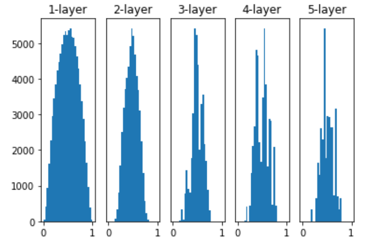
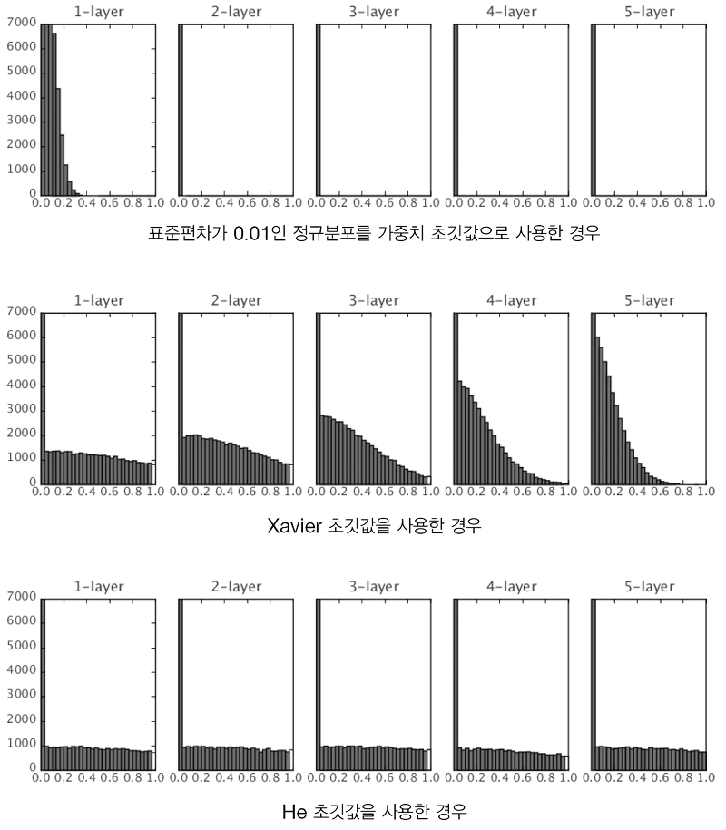

# Initialize Weight

신경망 학습에 있어서 가장 중요한 부분 optimizer를 공부했다. optimizer와 버금갈 정도로 중요한 부분이 weight initialize다.

## 1. 초기값을 모두 동일하게 하면?



위의 그림처럼 모든 weight들을 동일하게 주었을 때, output들의 값은 모두 $x+y+z$로 동일하게 된다. 

_**즉, layer를 쌓은 의미가 없다는 것이다.**_

이를 막으려면 weight들을 random 설정해야한다.

## 2. random하게 설정한 후, hidden layer의 값 분포

### 2-1. sigmoid



> 가중치가 표준편차가 1인 정규분포로 초기화할 때 각 층의 활성화된 분포

가중치가 표준편차 1인 정규분포로 초기화 했을 때, sigmoid 함수의 특징적인 부분 때문에, layer을 지날 때 마다, 약 극단으로 몰리는 현상이 벌어진다.

_**이 현상이 바로 기울기 소실, gradient vanishing 현상이다.**_



> 가중치가 표준편차가 0.01인 정규분포로 초기화할 때 각 층의 활성화된 분포

가중치가 표준편차 0.01인 정규분포로 초기화 했을 때, 수들이 가운데로 몰리는 경향 때문에, weight 값들이 전체적으로 퍼져있지 않는다.

_**바로 신경망의 표현력에 제한이 온다.**_

### Xavier

> n은 앞 층의 노드 수, $\frac{(x-\mu)}{\frac{1}{\sqrt{n}}}$ 값을 가지는 weight로 초기화하는 방법

```python
import numpy as np
node_num = 100 // 가정
np.random.randn(node_num, node_num) / np.sqrt(node_num)
```
일단 $w$ 는 $\frac{(x-\mu)}{\sigma}$를 한 값이고, random.randn은 평균이 0이고, 표준편차가 1인 정규분포의 값을 가진다. 이 값에서 $\sqrt{n}$을 나눠주어야
$\frac{(x-\mu)}{\frac{1}{\sqrt{n}}}$ 을 한 것 과 같아진다.



_**Xavier 방법을 쓰니 sigmoid activation function을 거쳐도 gradient vanishing이나 신경망의 표현력이 소실되는 현상은 벌어지지 않는다.**_

### 2-2. ReLU



ReLU 방법에서는 Xavier 방법도 먹히지 않는다. ReLU는 0이하면 무조건 0이기 때문에, 표준편차가 $\frac{1}{\sqrt{n}}$ 을 가지는 정규분포를 따르는 Xavier가 0 이하인 수가 많아 gradient vanishing이 되었다고 본다.

따라서 ReLU에서만은 다른 초기화 값으로 해야하고, 그 방법 중에 하나가 He 방법이다.

### He (MSRA)

Xavier가 표준편차가 $\frac{1}{\sqrt{n}}$ 을 가지는 정규분포를 따르는 방법이라면, _**He는 표준편차가 $\frac{2}{\sqrt{n}}$ 을 가지는 정규분포를 따르는 방법,**_ Xavier 보다 좀 더 표준편차가 넓은 정규분포를 가지는 숫자라는 것을 알수 있다.

우리는 _**ReLU의 특성인, 0 이하인 부분에서는 output이 모두 0이라는 점에서 He가 표준편차가 크게 하여 좀 더 weight 값들을 넓게 퍼트리려 한다**_ 고 직관적으로 알수 있다.

실제로 위의 그림을 보면, Xavier는 layer를 거칠수록 weight들이 왼쪽으로 쏠림 현상이 존재하는데, He은 표준편차가 상대적으로 커서, 여러 곳에 분포하고, ReLU의 여러 layer들을 거쳐도 전반적으로 고르게 퍼져있다.