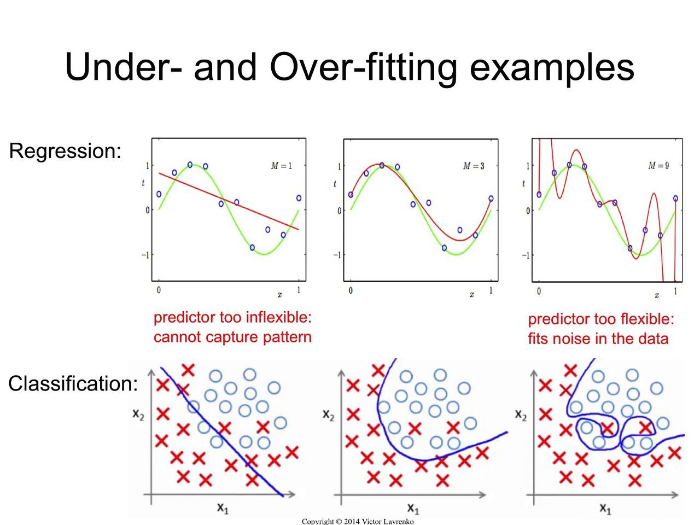

# Batch Normalization

## 1. 헷갈리는 용어 정리

### Regularization 

> 보통 번역은 '정규화' 라고 하지만 '일반화' 라고 하는 것이 이해에는 더 도움이 될 수도 있다. 모델 복잡도에 대한 패널티로 정규화는 Overfitting 을 예방하고 Generalization(일반화) 성능을 높이는데 도움을 준다. 

Regularization 방법으로는 _**L1 , L2 , Dropout, Early stopping**_ 등이 있다.

### Standardization

$$ X' = \frac{X - X_{min}}{X_{max} - X_{min}} $$

> min, max을 이용, [0,1] 사이로 표현

### Normalization

$$ X = \frac{x-\mu}{\sigma} $$

> $\mu, \sigma$ 을 기준으로 평균을 0, 표준편차를 1로 하는 가우시안 분포로 표현

## noramlization 장점

1. 학습 속도 개선
2. weight initialize에 크게 의존하지 않는다.
3. Dropout 등 필요성 감소 및 overfitting 억제

### normalization + DNN

### 방법 1. normalization

1. $\mu_B \leftarrow \frac{1}{m}\sum_{i=1}^m x_i$
2. $\sigma_B^2 \leftarrow \frac{1}{m}\sum_{i=1}^m (x_i-\mu_B)^2$
3. $\hat{x_i} \leftarrow \frac{x_i-\mu_B}{\sqrt{\sigma_B^2 + \varepsilon}}$
4. $B = {x_1, x_2, ... , x_m}$

> Affine layer을 통과한 값들을 normalization 시킨다.

### 방법 2. scale & shift

$$y = \gamma\hat{x} + \beta$$

> $\gamma$는 scale, $\beta$는 shift 작업을 하며, 이 작업이 Regularizaiton에 해당된다고 볼수 있다.

## Overfitting

> training data에 너무 적합한 model. 다른 test data를 입력해서 test를 해보면, 성능이 굉장히 낮게 나온다.

### Overfitting 등장 배경

1. 매개변수가 많고, 표현력이 높은 모델
2. 데이터가 적은 경우

## 1. Regularization : Weight Decrease 

> 학습 과정에서 큰 weight에 대해서는 penalty를 부과하여 오버피팅을 막는 방법

e.g) L1이나 L2 를 Loss Function에 더해서 더 cost가 높이 나온 값은 penalty 더한만큼 높아지니 도합 penalty는 상대적으로 더 커져서 모델을 fitting을 잘 할수 있을 것이다.

## 2. Regularization : Dropout

# Hyperparameter

- learning rate
- node 갯수
- 등등