# Batch Normalization

## 1. 헷갈리는 용어 정리

### 1-1. Regularization 

> 보통 번역은 '정규화' 라고 하지만 '일반화' 라고 하는 것이 이해에는 더 도움이 될 수도 있다. 모델 복잡도에 대한 패널티로 정규화는 Overfitting 을 예방하고 Generalization(일반화) 성능을 높이는데 도움을 준다. 

Regularization 방법으로는 [다음 regularization.md 파일](06-7_regularization.md)을 보면 된다.

### 1-2. Standardization

$$ X' = \frac{X - X_{min}}{X_{max} - X_{min}} $$

> min, max을 이용, [0,1] 사이로 표현

### 1-3. Normalization

$$ X = \frac{x-\mu}{\sigma} $$

> $\mu, \sigma$ 을 기준으로 평균을 0, 표준편차를 1로 하는 가우시안 분포로 표현

------------------

## 2. Batch Normalization

#### 1) Purpose

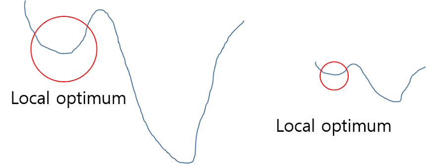

기본적으로 정규화를 하는 이유는 학습을 더 빨리 하기 위해서 or Local optimum 문제에 빠지는 가능성을 줄이기 위해서 사용한다. 아래 그림을 보면 이해가 쉽게 될 것 같다. 아래 그림에서 최저점을 찾을 때 그래프를 전체적으로 이해하지 못하여 global optimum 지점을 찾지 못하고 local optimum 에 머물러 있게 되는 문제가 발생하게 된다. 이러한 문제점은 정규화 하여 그래프를 왼쪽에서 오른쪽으로 만들어, local optimum 에 빠질 수 있는 가능성을 낮춰주게 된다.

### 2-1. Internal Covariate Shift

#### 1) Covariate Shift

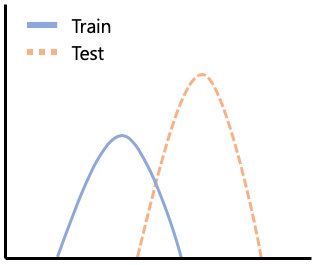

> _**covariate shift란 Network의 각 층이나 Activation 마다 input의 distribution이 달라지는 현상을 의미한다.**_ data가 엄청 크게 변하게 된다면 그 다음 layer의 input distribution은 고정되어 있지 않고 변동이 생긴다. 이는 안정적인 학습이 되지 않는 원인을 불러온다. _**covariate shift가 Train 및 Test set 간의 분포 차이를 가져오고, Gradient Exploding, Vanishing을 가지고 온다.**_

#### 2) Internal Covariate Shift

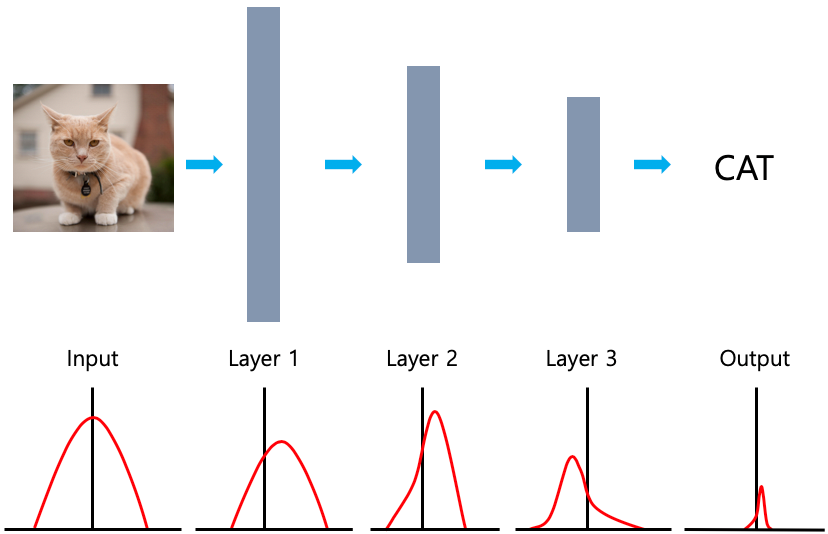

> _**Internal Covariate Shift란 Input과 Output 의 분포에 차이가 있다는 것이다.**_ 즉, 다시 말하면 데이터가 레이어를 거치게 되는데 이때 각 레이어에서 Covariate Shift가 일어나게 되고 이것이 다음 레이어로 전이되면서 결국에는 Output과 Input 데이터의 분포 간의 큰 차이가 생기는 것을 Internal Covariate Shift라고 한다. _**앞 단의 차이가 뒤로 전이되며 누적됨으로 이문제는 레이어가 깊을수록 크게 나타난다.**_

_**따라서 datat의 channel마다 Batch Normalization을 통해서 input을 일정하게 맞춰주려한다.**_

### 2-2. whitening

> 각각의 layer input 의 distribution 은 학습 중 이전 layer 의 변화에 의해 매번 달라진다. _**이를 막기 위해 각 층의 출력물을 다음 층에 입력하기 전에 평균 0, 표준편차 1 로 normalize 할 수 있다.(이를 whitening 이라고 한다.)**_ 

하지만 이렇게 단순하게 normalize 할 경우 문제가 생긴다.

이는 _**covariance matrix의 계산과 inverse의 계산이 필요하기 때문에 계산량이 많을 뿐더러, Whitening은 일부 파라미터들의 영향이 무시된다.**_ 

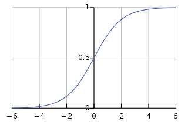

1. 평균0, 분산1로 하게되면 (-1.96, 1.96) 사이에 95%의 수가 존재하게 되고 sigmoid 의 경우 선형을 가진다. 즉 layer를 쌓아도 의미가 없다는 것이다.
2. 또한 입력 값 X를 받아 Z = WX + b 라는 결과를 내놓고 적절한 bias b 를 학습하려는 네트워크에서 Z에 E(Z) 를 빼주는 작업을 한다고 생각해보면, 이 과정에서 b 값이 결국 빠지게 되고, 결과적으로 b의 영향은 없어지게 된다. 단순히 E(Z)를 빼는 것이 아니라 표준편차로 나눠주는 등의 scaling 과정까지 포함될 경우 이러한 경향은 더욱 악화 될 것이며, 논문에서 실험으로 확인을 했다고 한다. 이렇듯 단순하게 Whitening만을 시킨다면 이 과정과 파라미터를 계산하기 위한 최적화(Backpropagation)과 무관하게 진행되기 때문에 특정 파라미터가 계속 커지는 상태로 Whitening 이 진행 될 수 있다.

### 2-3. Batch Normalization

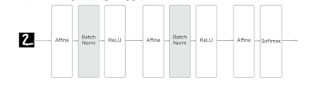

> 배치 정규화는 평균과 분산을 조정하는 과정이 별도의 과정으로 떼어진 것이 아니라, 신경망 안에 포함되어 학습 시 평균과 분산을 조정하는 과정 역시 같이 조절된다는 점이 단순 Whitening 과는 구별된다. 
> _**즉, 각 레이어마다 정규화 하는 레이어를 두어, 변형된 분포가 나오지 않도록 조절하게 하는 것이 배치 정규화이다.**_ 

#### 방법 1. normalization

$$\mu_B \leftarrow \frac{1}{m}\sum_{i=1}^m x_i$$ $$\sigma_B^2 \leftarrow \frac{1}{m}\sum_{i=1}^m (x_i-\mu_B)^2$$ $$\hat{x_i} \leftarrow \frac{x_i-\mu_B}{\sqrt{\sigma_B^2 + \varepsilon}}$$ $$B = {x_1, x_2, ... , x_m}$$

> Affine layer을 통과한 값들을 normalization 시킨다. 여기서 m이 channel의 갯수이고, normalize는 channel 별로 시킨다.

#### 방법 2. scale & shift

$$y = \gamma\hat{x} + \beta$$

> $\gamma$는 scale, $\beta$는 shift 작업을 하며, 이 작업이 Regularizaiton에 해당된다고 볼수 있다.
> 
### 2-4. 장점

1. 학습 속도 개선
2. weight initialize에 크게 의존하지 않는다.
3. Dropout 등 필요성 감소 및 overfitting 억제
4. non linear mapping 관계 설명 쉽다

### 2-5. 단점

1. 원래 data의 distribution이 존재하는데 이를 Batch로 normalize 하니 data 유실

-------------

## 2. Overfitting & Hyperparameter

### 2. Overfitting

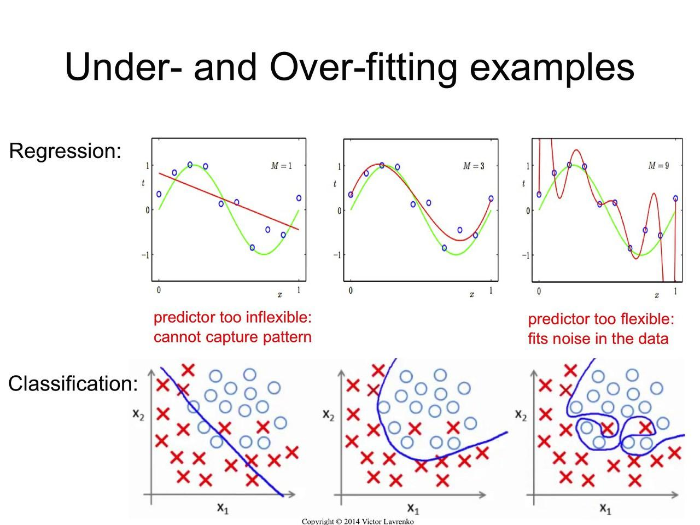

> training data에 너무 적합한 model. 다른 test data를 입력해서 test를 해보면, 성능이 굉장히 낮게 나온다.

### 2-1. Overfitting 등장 배경

1. 매개변수가 많고, 표현력이 높은 모델
2. 데이터가 적은 경우

### 2-2. 해결방법

1. Hyperparameter를 조절
2. [Regularization](06-7_regularization.md)

-------------

## 3. Hyperparameter

### 3-1. Learning rate

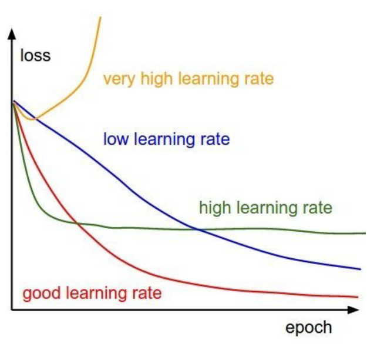

learning rate를 어떻게 설정하느냐에 따라 optimize가 되기도 하고 안되기도 한다.

#### 1) epoch 마다 0.1 곱해서 줄이자

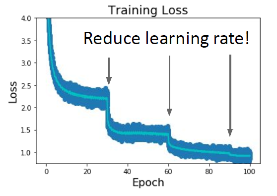

#### 2) linear 하게 줄이자

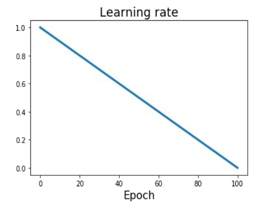

#### 3) inverse sqrt

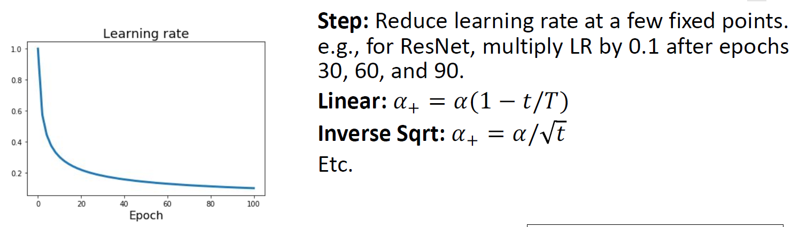

- 𝛼 : initial learning rate
- 𝛼+ : learning rate at epoch 𝑡
- 𝑇 : total number of epoch

### 3-2. Coarse-to-fine cross-validation in stages

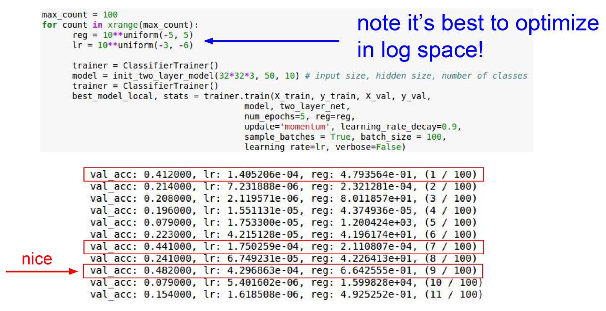

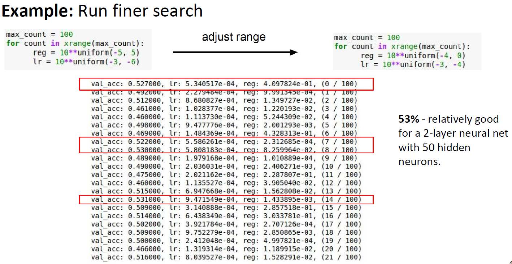

> 처음에는 coarse 대략적으로 run을 돌려보고 lr와 reg을 봤을 때 특정 수치에서 Val_Acc가 높게 나온다면 stop하고 finer search를 더 해본다.

### 3-3. Grid vs Random

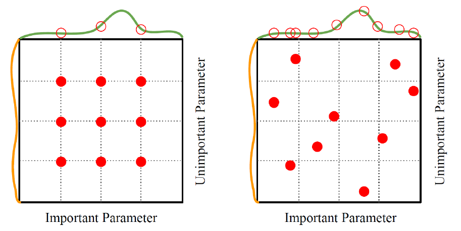

grid하게 하면 그림처럼 특정 파라미터 하나에 대해서는 겹쳐서 select하는 것과 똑같다. random search를 하는 것이 제일 좋다.

### 3-4. Monitor Loss Curve

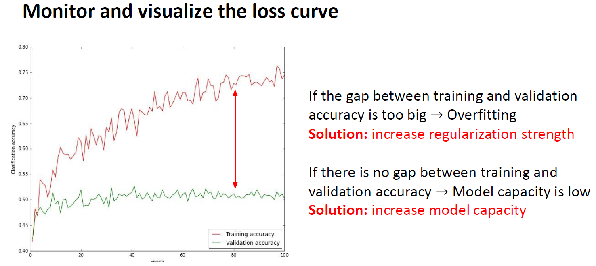

1. 만약 Training curve와 validation curve gap이 너무 차이나면 ? overfitting
2. Training과 Validation Gap이 너무 없으면? Model의 capacity가 작은 것이니 model을 좀 키워보자

### 3-5. Early Stopping

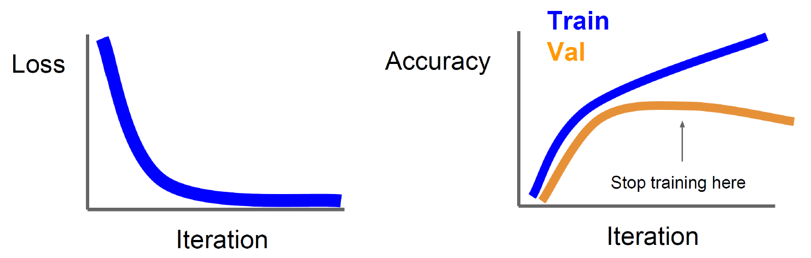

iteration이 반복될수록 Training curve와 validation curve가 weight가 변하면서 변할 수 있다. 따라서 두 개의 curve가 가까워 질 때쯤 멈추는 것이다.

### 3-6. Model Ensemble

독립적인 Model을 여러개 만드는 것이다.

### 3-7. Snapshot Ensemble Learning

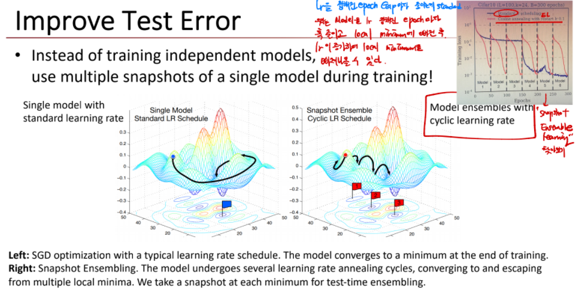

independent model을 train 하기 전에 multiple snapshot ensemble learning 을 진행한다. 이는 learning rate를 줄여나가다가 0.1로 다시 restart 한다. 만약 그래프가 위의 그림처럼 생겼을 때 기존처럼 learning rate를 줄이면 local minimum 벗어나기 어렵지만, snapshot ensemble learning을 하게 되면 hop 하듯이 local을 벗어날 수 있다.

---------------

## Reference

1. [Batch Normalization 이해 쏙쏙](https://blog-st.tistory.com/entry/MLDL-Batch-Normalization)
2. [Batch Normalization 전문적인 느낌, 상세하다](https://m.blog.naver.com/laonple/220808903260)
3. [Batch Normalization 수식 전문](https://hcnoh.github.io/2018-11-27-batch-normalization)