# Regularization

---------

## 1. L1, L2, ElasticNet

### 1-1. 정의

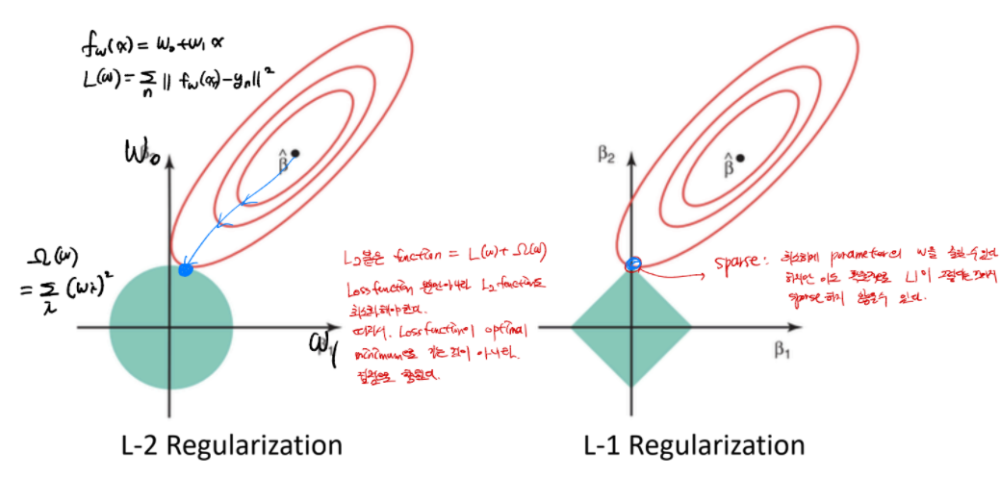

$$\frac{1}{N}\Sigma L(f_W(x_i), y_i) + \lambda\Omega(w)$$

- L2 : $\Omega(w)= \Sigma_{k,l}W_{k,l}^2$
- L1 : $\Omega(w)= \Sigma_{k,l}|W_{k,l}|$
- ElasticNet : $\Omega(w)= \Sigma_{k,l}\beta W_{k,l}^2 + |W_{k,l}|$

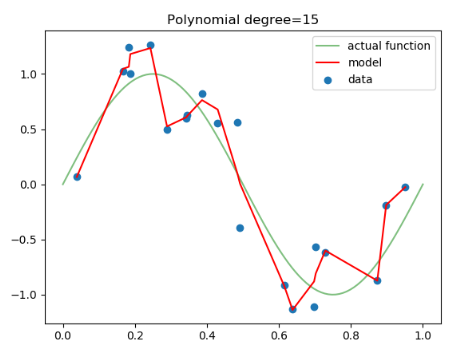

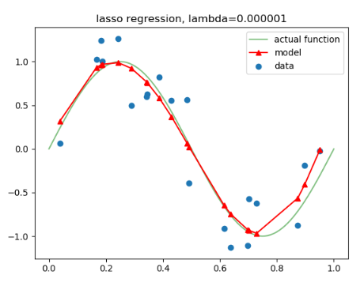

이 패널티 항목으로 많이 쓰이는 것이 L1 Regularization과 L2 Regularization이다. Weight decay 를 적용할 경우 위 두번째 그림처럼 Overfitting에서 벗어날 수 있다.

### 1-2. L1, L2 의 차이점

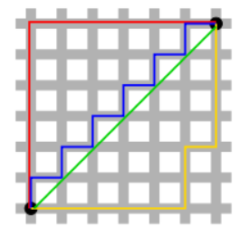

$$a = (0.3, -0.3, 0.4)$$ $$b = (0.5, -0.5, 0)$$

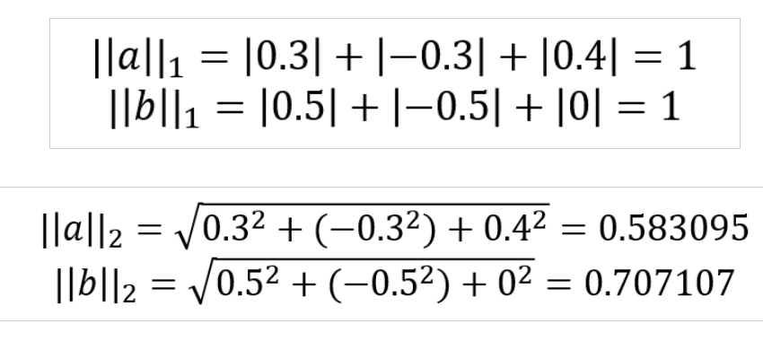

- 초록샌 선이 L2 norm
- 빨간, 파란, 노란 선은 다른 경로를 움직m이다. 그 이유는 위의 그림을이지만 사실 모두 같은 L1 Nor 보면 나와있다. a,b라는 벡터는 다른 성분이지만 L1을 거치면 같은 성분으로 바뀐다.

------------

## 2. Dropout

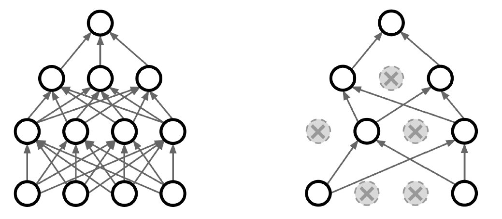

> Dropout은 일정 비율 이상으로 node를 버리는 것이다. 보통 0.5가 일반적이다.

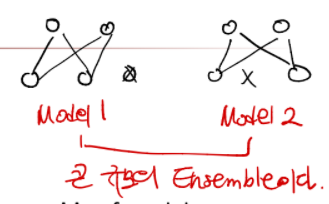

_**또한 Dropout은 큰 규모의 ensemble이라고 생각하자.**_

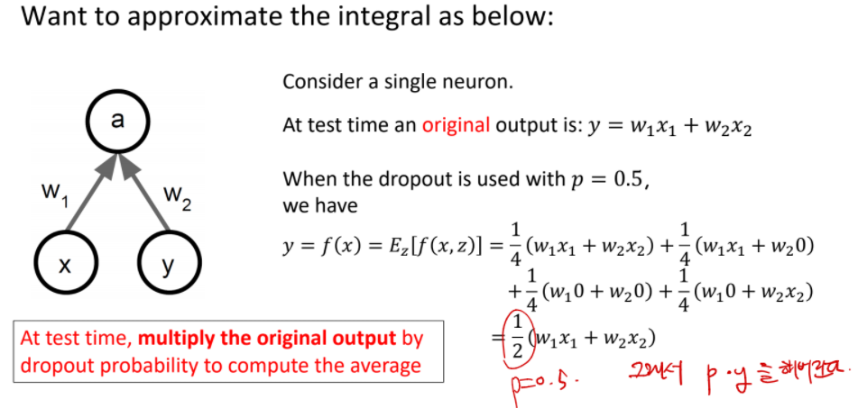

training 하는 동안, dropout의 output은 random하기 때문에 이 randomness를 확률을 곱해버린다.

-----------

## 3. Data Augmentation

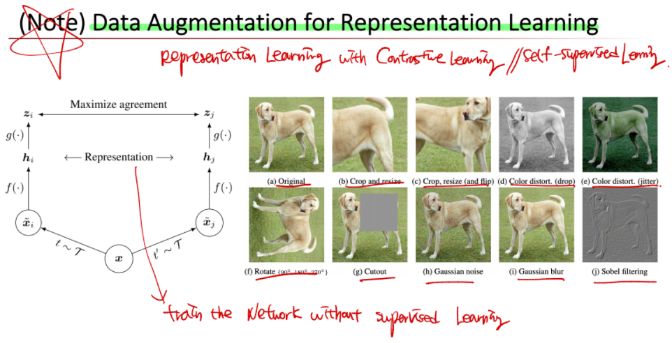

> 한정적인 data를 늘리기위한 방법이다.

------------

## 4. DropConnect

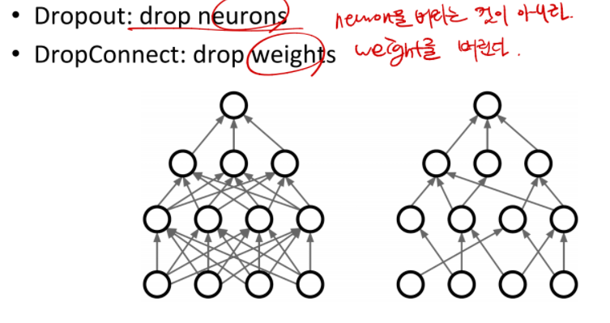

> DropConnect는 뉴런을 버리는 것이 아니라, weight를 버린다.

-------------

## 5. Fractional Pooling

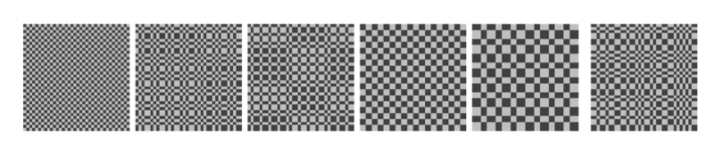

> data에 randomness를 줘서 어떻게하면 Model의 capacity를 높일 수 있을까? --> _**pooling을 fraction, 부분적으로 진행한다.**_

-----------

## 6. Stochastic Depth

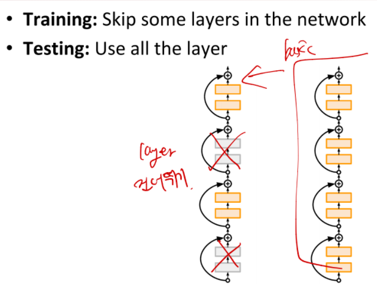

> training 할 때는 layer를 몇개 skip, test할 때는 all layer 다쓴다.

-----------

## 7. Mix Up

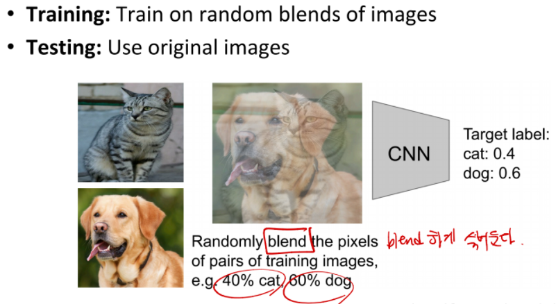

> pixel들을 random하게 blend하게 섞는다.

-----------

## 8. Transfer Learning

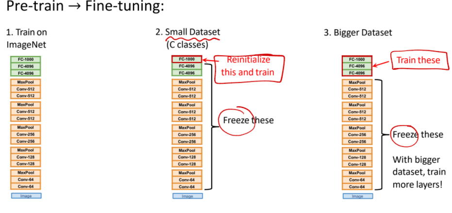

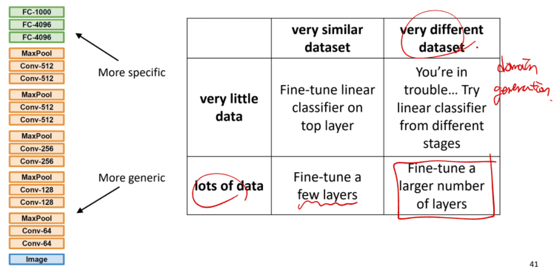

> 처음 training을 하고 다른 dataset을 다룰 때는 CNN쪽은 Freeze하고 Fully Connected Layer 쪽을 따로 튜닝한다. Fast R-CNN에서도 많이 쓴다.
