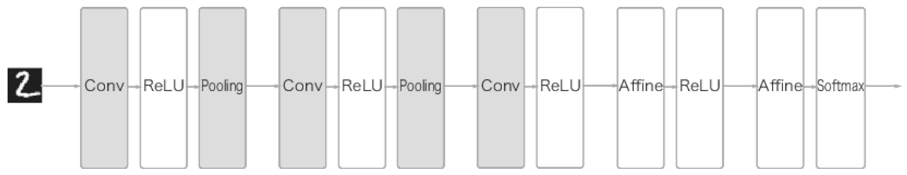

# CNN

## 1. 정의

> Convolutional Neural Network은 합성곱 신경망으로써 input data와 filter의 값과 곱셈을 통해서 활성화되는 구조로 구축한 신경망

## 2. 구조

1. CNN은 affine 계층 대신, Conv layer 를 거치고, ReLU를 거치면서 activate가 된 값들이 여러가지 방법의 pooling layer을 거치면서 지나간다.
2. Conv 을 거친 layer들은 마지막에 fully-connected layer, affine 계층을 거쳐서 softmax를 타고 classification을 진행한다.

## 3. 용어 정리

- FC : Fully-connected
- feature map : 입출력 data
  - input feature map
  - output feature map
- filter, kernel, winodw : input data와 연산하는 layer
- stride : filter를 적용하는 움직임의 간격
- pooling : 가로 세로방향의 공간을 줄이는 연산
- channel : data의 depth

## 4. FC vs CNN

사진은 3차원 데이터이다. Fully-Connected layer를 지나려면, 3차원 데이터를 1차원 벡터로 변환하여 1렬로 줄을 세워야 한다. 하지만 우리 image data들은 양옆으로 관계가 존재하지만, 위아래로도 서로 관계가 존재한다. 따라서 _**1차원 벡터로 변환하면 data의 형상이 무너지는 단점이 존재한다.**_

합성곱은 데이터의 형상이 유지된다.

## 5. CNN 연산

### 5-1. Filter

- 4*4 행렬은 _**input feature map**_ 이다.
- 3*3 회색 행렬은 _**filter, kernel, window**_ 라고 한다.
- 2*2 행렬은 _**output feature map**_ 이다.

_**CNN에서는 filter 안에 들어있는 수들이 weight 값이 된다.**_

bias 같은 경우는 _**broadcast**_ 를 통해서 output feature map에 적용이 된다.

#### CNN calculation example

### 5-2. padding

> padding은 합성곱 연산을 하기 전에, input feature map의 테두리 크기를 늘리는 작업이다.

테두리에 data를 채울 때는, 0으로 채우기도 한다.

#### 목적

본래 목적은 Conv layer를 거치면서 _**output feature map의 크기가 줄어들지 않고, 일정한 size로 만드는 역할을 한다.**_

### 5-3. stride

> filter를 적용하는 움직임의 간격

stride가 2로 window를 옮길 때의 그림

### 5-4. output size 계산방법

$$OH = \frac{H+2P-FH}{S} + 1$$
$$OW = \frac{W+2P-FW}{S} + 1$$

$FH, FW$ : filter의 height, width를 말한다.

출력크기가 정수가 아니면, 오류를 내는 대응을 해야한다. 하지만 다른 프레임워크에서는 가까운 정수로 반올림하거나, 특별한 에러를 내지않고 진행하도록 구현하는 경우도 있다.

### 5-5. Pooling

> 가로 세로 방형의 공간을 줄이는 연산이다.

위의 그림은 window size를 2*2로 설정하였고, stride도 2로 설정되어 연산하는 과정이다. 보통 _**통상적으로 window size와 stride를 동일하게 설정**_ 한다.

### Pooling 특징

1. 학습해야야할 parameter가 없다.
   - Max 값을 취할지
   - Min 값을 취할지
   - Average 값을 취할지
2. channel 수가 변하지 않는다. channel마다 독립적으로 계산하기 때문이다.
3. input의 변화에 크게 영향을 받지 않는다. 
   - 데이터에 따라 다르기는 하지만, 통상적으로 pooling에서는 어차피 max를 뽑기 때문에, max 값이 바뀌지만 않으면 어차피 pooling 결과값은 동일하다.

## 6. CNN 3차원 연산

_**filter의 channel수를 input data의 channel의 수에 맞게 쌓아야한다. 그 이유는 channel 마다 filter안에 weight 값들이 다르기 때문이다. 또한 filter의 channel수 data들의 shape 을 망가뜨리지 않고 data들의 상관관계를 파악할 수 있다.**_

### Batch 처리까지한 CNN

한번에 N개의 data를 다루는 연산으로 변하면서 input data가 3차원에서 4차원으로 변한다.

## 7. CNN visualization

### 7-1. filter weight 학습하기 전, 후

filter의 weight들이 학습하기 전에는 형태를 알아보기 힘들다가, 학습 후에는 규칙성 있는 이미지로 변화하였다.

### 7-2. filter weight의 의미

학습된 filter들을 image에 씌워보았더니, 각각 filter가 의미하는 부분이 명확하게 보이는 것을 볼수 있다.

> 개인적으로 이 부분이 제일 중요한 것 같다. 
> _**Deep Learning은 inpretable한 구조가 제일 좋은 구조라고 생각한다.**_ 
> 이처럼 각 filter안에 weight들이 어떠한 의미를 가지는지 보여주는 것 자체가 굉장히 의미있다고 생각한다.

### 7-3. depth 에 따흔 추출 정보의 변화

> depth가 깊어질수록, 추출되는 정보가 더 추상화된다!

Deep Learning의 흥미로운 점은, 위와 같이 CNN을 depth가 깊도록 여러층을 쌓으면, 층이 깊어지면서 더 복잡하고 추상화된 값이 추출된다는 것이다. 처음 층은 간단한 edge에 반응하고, 그 다음층은 texture, 그 다음층은 더 복잡한 사물의 일부에 반응하였다.

즉, _**층이 깊어지면서 좀 더 추상화된 값, 단순한 모양에서 고급 정보로 변화해간다. 사물의 의미를 이해하도록 변화한다는 것이다.**_