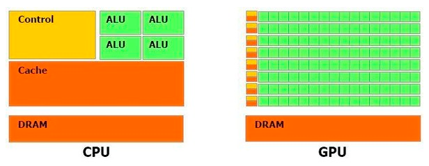
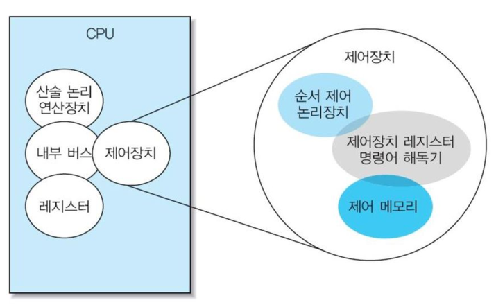
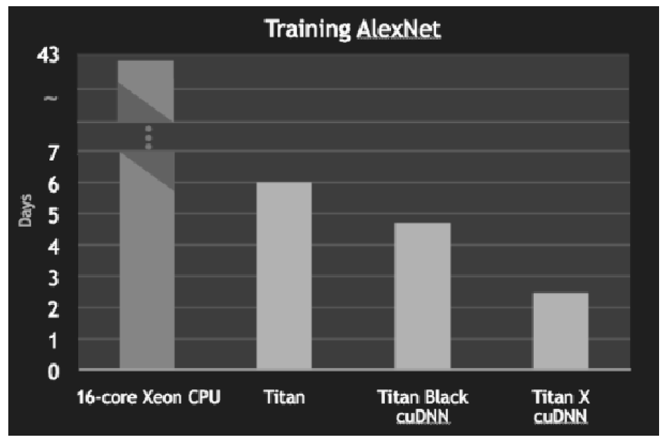
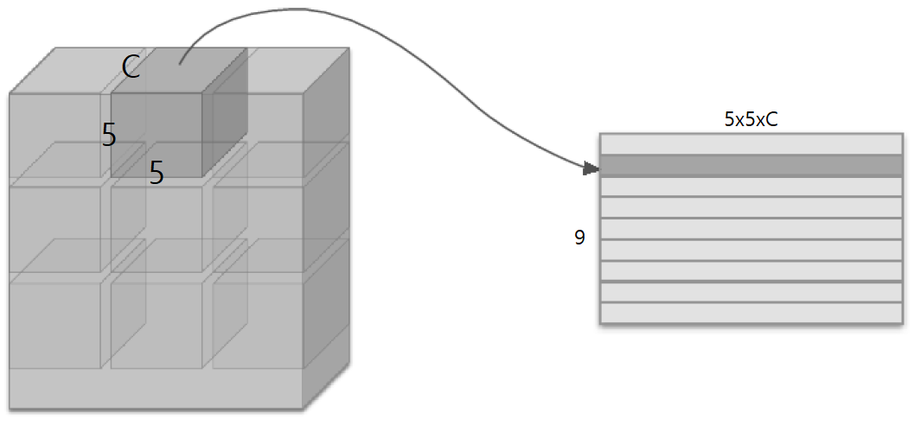
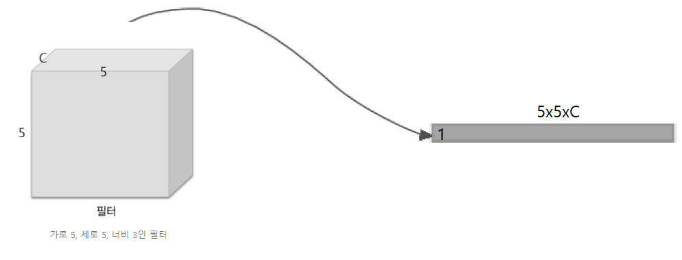
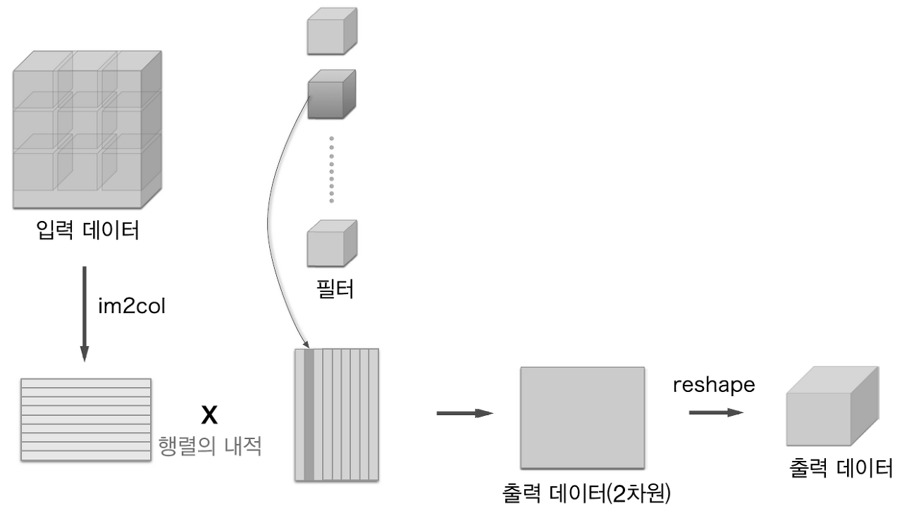
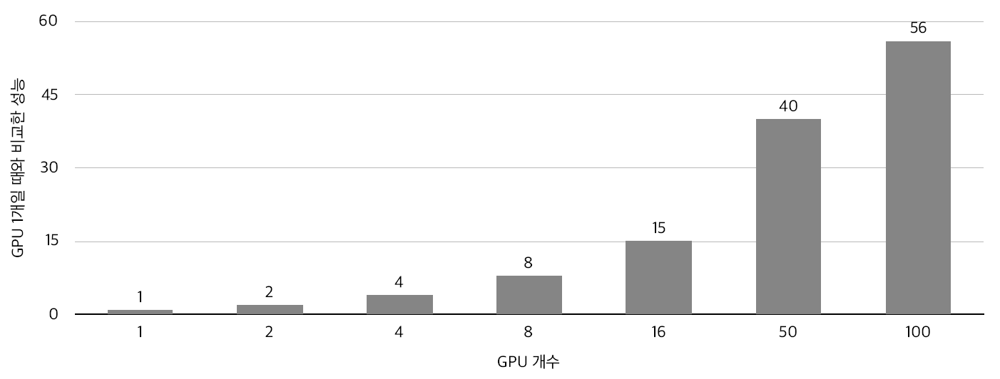
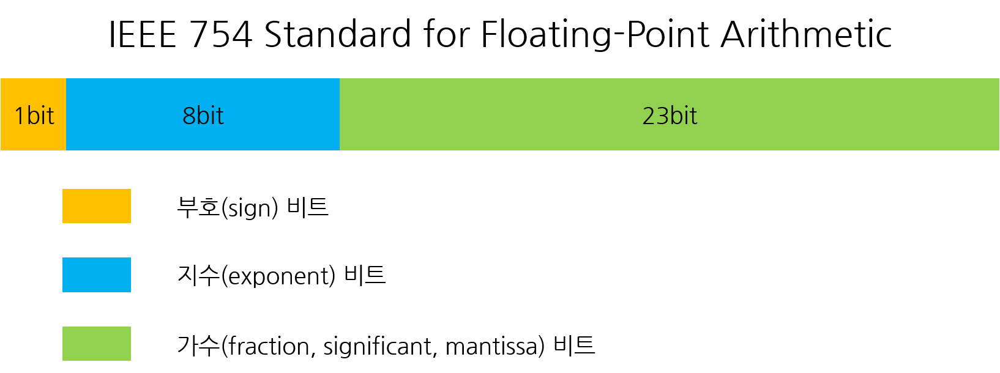

# DeepLearning acceleration

> DeepLearning은 한마디로 표현하면 행렬의 연산이다.

따라서 어떻게 하면 행렬의 연산을 고속화할지가 DeepLearning의 성능을 좌지우지할 것이다.

이 때, 빠른 행렬의 연산을 위해 사용되는 하드웨어는 _**GPU**_ 이다.

---------

## 1. GPU vs CPU

### 1-1. 정의

> - CPU (Central Processing Unit) : CPU는 입출력장치, 기억장치, 연산장치를 비롯한 컴퓨터 리소스를 이용하는 최상위 계층 장치인 '중앙처리장치'로써, 컴퓨터의 두뇌와 같은 역할을 담당합니다. 따라서 데이터 처리와 더불어 프로그램에서 분석한 알고리즘에 따라 다음 행동을 결정하고 멀티태스킹을 위해 나눈 작업들에 우선순위를 지정하고 전환하며 가상 메모리를 관리하는 등 컴퓨터를 지휘하는 역할을 수행합니다. 컴퓨터 프로그램의 대부분은 복잡한 순서를 가진 알고리즘을 가지고 작동하므로 CPU가 적합하다.

> - GPU (Graphic Processing Unit) : GPU는 비디오, 즉 픽셀로 이루어진 영상을 처리하는 용도로 탄생했습니다. 이 때문에 CPU에 비해 반복적이고 비슷한, 대량의 연산을 수행하며 이를 병렬적으로(Parallel) 나누어 작업하기 때문에 CPU에 비해 속도가 대단히 빠릅니다. 영상, 렌더링을 비롯한 그래픽 작업의 경우 픽셀 하나하나에 대해 연산을 하기 때문에 연산능력이 비교적 떨어지는 CPU가 GPU로 데이터를 보내 재빠르게 처리합니다.

### 1-2. CPU, GPU 성능체크

1. **클럭(동작 속도)의 수치** : 높으면 단일 작업을 빠르게 처리하는데 유리하다.
2. **코어(핵심 회로)의 수** : 멀티태스킹을 하거나 멀티코어 연산에 최적화된 프로그램을 구동하는데 이점이 있다.
3. **캐시 or 메모리의 용량** : 크기가 큰 프로그램을 구동하거나 자주 하는 작업을 반복 처리할 때 작업 효율을 높일 수 있다
4. GPU의 경우 : Bus 대역폭 (흐르는 데이터의 양을 수용할 수 있는 능력)

### **1-3. Deep Learning에 최적화된 하드웨어? --> 구조로 파악**




Deep Learning에 최적화된 하드웨어는 CPU와 GPU의 구조를 살펴보면 된다.

- cache는 memory에서 자주 쓰는 정보들을 저장하는 역할을 한다. CPU는 cache가 CPU 전반을 차지한다.
- Control : 제어장치에 해당한다.
- ALU : 산술논리장치, 요즘은 부동소수점 장치(FPU)로 대체된다. 정수형 ALU만 있다면 소프트웨어 개발자도구에서 부동소수점을 계산하는 기계어 코드를 이용한다. ALU랑 FPU랑 같이 생각하면 된다.

> _**CPU는 절반이상이 캐시로 채워져 있기 때문에, 반복적인 작업에 용이하다. 하지만 산술, 논리연산을 하는 ALU의 자리가 많이 없어 연산을 빨리하기에는 속도가 느릴 수 밖에 없다.**_

#### **GPU가 뛰어난 이유**

CPU는 board의 절반은 cache가 차지하고 ALU는 소수에 해당한다. 하지만 GPU는 값을 저장하는 memory외에는 모두 ALU 계산이다. 그 이유는 모든 그래픽 처리는 벡터연산이기 때문이다.

> _**따라서 행렬의 간단한 연산을 필요로하는 Deep Learning은 많은 core수를 가지고 있어 병렬 수치연산을 고속으로 처리하는 GPU로 연산하는 것이 훨씬 빠르게 돌릴 수 있다.**_



실제로 연산한 속도를 보면 아무리 뛰어난 16코어의 titan CPU여도 GPU를 따라가지 못한다.

----------------------

## 2. CUDA (Compute Unified Device Architecture)

GPU는 보통 nvidia, AMD 두 개의 회사가 제공한다.

### 2-1. 정의

> [nvidia의 GPU 컴퓨팅용 통합개발환경](https://developer.nvidia.com/cuda-toolkit)

### 2-2. cuDNN

> CUDA 위에서 동작하는 라이브러리이며 딥러닝에 최적화되 함수들이 구현되어있다.

----------------------

## 3. im2col (Image to Column)

#### 3-1. 정의 

CNN은 3차원의 데이터 (주로 이미지)를 학습시키는데 특화되어있는 신경망이다.

```python
import numpy as np

x=np.array([[[1,2,3,0],
                [0,1,2,3],  # --> red 행렬
                [3,0,1,2],
                [2,3,0,1]],
              [[2,3,4,1],
               [1,2,3,4],  # --> green 행렬
               [4,1,2,3],
              [3,4,1,2]],
             [[3,4,5,2],  # --> blue 행렬
              [2,3,4,5],
              [5,2,3,4],
              [4,5,2,3]]])

print (x.ndim)  # 3
print (x.shape)  # (3,4,4)  (차원,행,열)

f=np.array([[[2,0,1],
               [0,1,2],
               [1,0,2]],
               [[3,1,2],
                [1,2,3],
                [2,1,3]],
                [[4,2,3],
                [2,3,4],
                [3,2,4]]])

print ( f.ndim )  #  3
print ( f.shape ) #  ( 3, 3, 3 )

output = np.zeros([x.shape[1]-f.shape[1]+1,x.shape[2]-f.shape[2]+1])

fh,fw = f.shape[1], f.shape[2]

for i in range(output.shape[0]):
    for j in range(output.shape[1]):
        for k in range(x.shape[0]) :
            output[i,j]+=np.sum(x[k][i:fw+i,j:fh+j]*f[k])
            
print(output)
```

차원이 큰 데이터에 대해서도 정보를 잃지 않기 위해 합성곱을 사용하기 때문에 for문을 여러개를 사용해야 한다.for문을 여러번 사용해야 합성곱 연산을 할 수 있다. 하지만 이런 식이라면 연산 속도가 매우 떨어질 것이다.

> _수만건의 데이터를 처리해야하는 CNN은 이러한 연산속도 저하 문제를 어떻게 해결할까?_
**그에 대한 해결이 im2col 함수이다.**


위의 이미지는 im2col의 동작을 단적으로 보여주고 있다. im2col은 쉽게 말해서 다차원의 데이터를 행렬로 변환하여 행렬 연산을 하도록 해주는 함수를 말한다.

> _**다차원 데이터의 합성곱(convolution)은 im2col을 통해 행렬로 변환된 데이터의 내적과 같다.**_

### 3-2. 과정-1 : input data를 filter에 맞게 벡터화



### 3-2. 과정-2 : filter를 벡터화



### 3-2. 과정-3 : 벡터화된 데이터를 벡터화된 filter로 하나씩 연산한 후 reshape



_**정확하게 말하자면 데이터들은 정확히는 3차원이 아니라 4차원이다.**_ 여기를 보면 알다시피 입력 데이터는 (N,C,H,W)로 구성되어있으며 N은 _**데이터의 갯수를 의미하는 배치 사이즈를 뜻한다.**_ 
따라서 정확히는 입력 데이터와 filter 데이터, 출력 데이터 모두 4차원이지만 이해를 돕기위해 입력 데이터 1개와 필터 1개를 예시로 하여 3차원으로 설명하였으니 오해가 없길 바란다.

----------------------

## 4. GPU 병렬 연결



GPU를 한개만 연결할 때보다 연달아 연결할 때 속도가 56배 빨라지는 것을 확인할 수 있다.

----------------------

## 5. 연산 정밀도와 비트 줄이기

GPU의 성능은 3가지로 나뉜다.

1. 계산 속도 : 행렬의 연산
2. 메모리 용량 : weight와 중간 데이터를 메모리에 저장해야함.
3. 버스 대역폭 : 숫자가 커버리면 GPU를 지나는 버스에 흐르는 데이터가 많아진다.

보통 컴퓨터에서는 _**부동소수점 수**_ 를 사용해서 실수를 표현한다. _**많은 비트를 사용할수록 계산오차는 줄어들지만, 그만큼 계산에 드는 비용과 메모리 사용량이 늘고 버스 대역폭이 부담된다.**_ 따라서 이러한 줄다리기를 잘 생각해서 해야한다.

보통은 16비트 반정밀도를 사용해도 학습에 큰 문제는 없다고 밝혀져있다. 16비트로 시작하니 이전 보다 2배정도 빨라졌다고 한다.

### 5-1. 프로그래밍 언어

일반적으로 python은 64bit 부동소수점을 쓴다.

하지만 numpy는 16bit 반정밀도 부동소수점을 지원하지만 스토리지로써 16bit를 가지는 것이지 연산자체를 16bit를 쓰지 않는다.

#### cf) 부동소수점



고정 소수점으로 나타낸 263.3을 2진수 부동 소수점 방식으로 변환해 보자. 

100000111.010011001100110... 으로 표현되던 것을 맨 앞에 있는 1 바로 뒤로 소수점을 옮겨서 표현하도록 변환한다. 그러면 1.00000111010011001100110... * 2^8(2의 8승) 으로 표현된다.

2^8의 8을 지수라고 하고 하늘색 부분에 기록한다. (IEEE 754 표현 방식에서는 127 + 지수를 기록한다.)
소수점 이후 숫자열 전체를 가수라고 하고 연두색 부분에 기록한다.
이 방식에 따라서 263.3을 기록하면

    부호 비트(1 bit) : 0 (양수)
    지수 비트(8 bit) : 10000111 (127 + 8 = 135)
    가수 비트(23 bit) : 00000111010011001100110

하지만! 여기서도 0.010011001100110은 정확히 0.3을 나타낼 수는 없다. 10진수로 나타내 보면 0.29998779296875을 나타낸다.