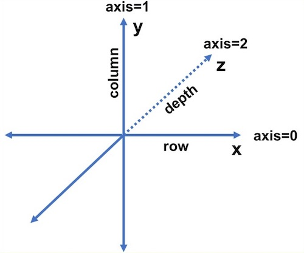
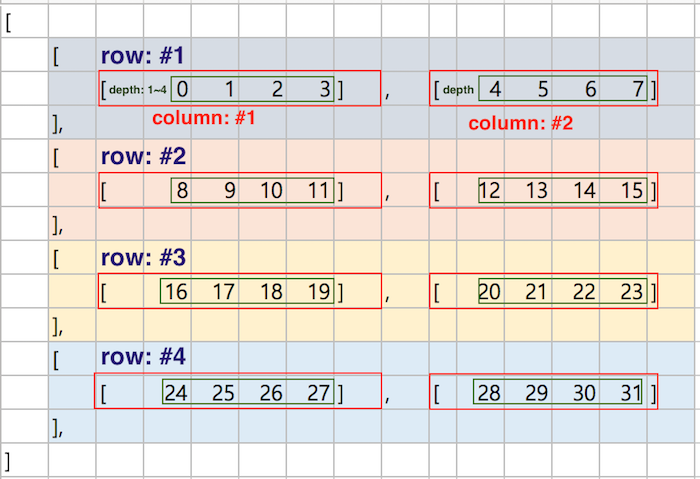
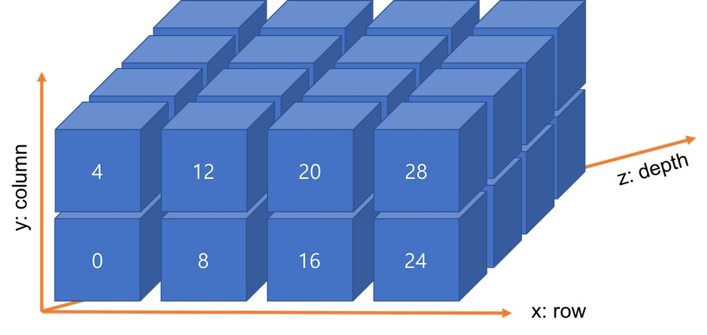
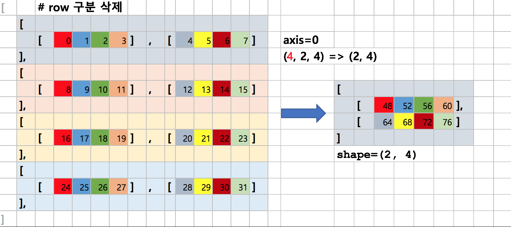
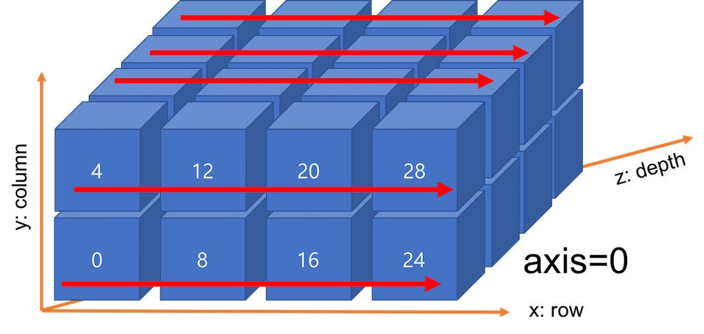
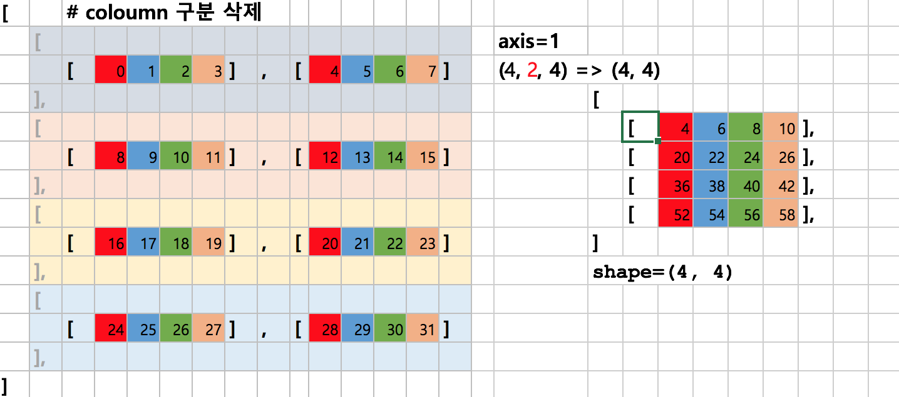
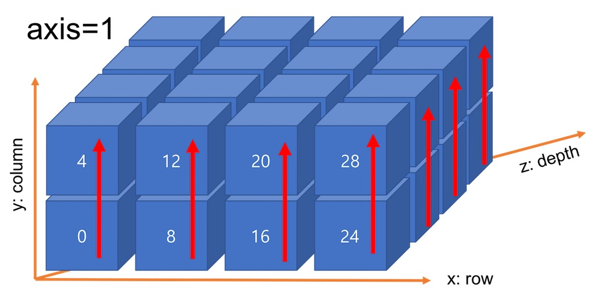
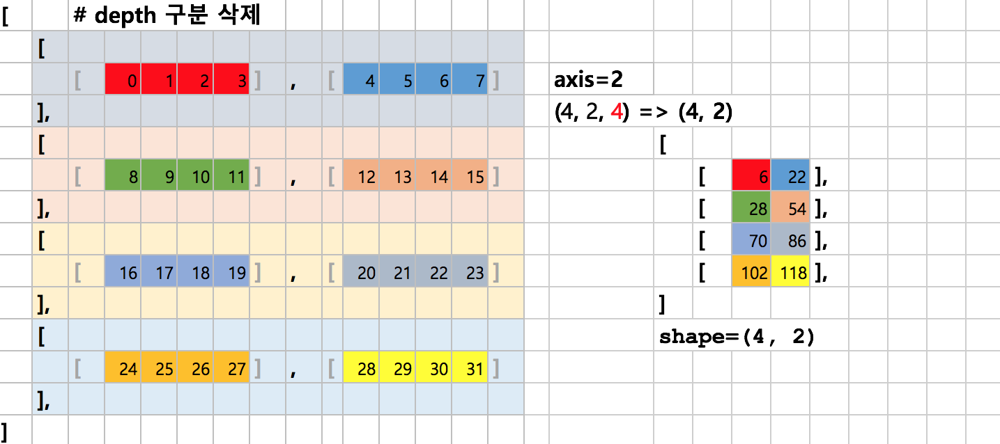
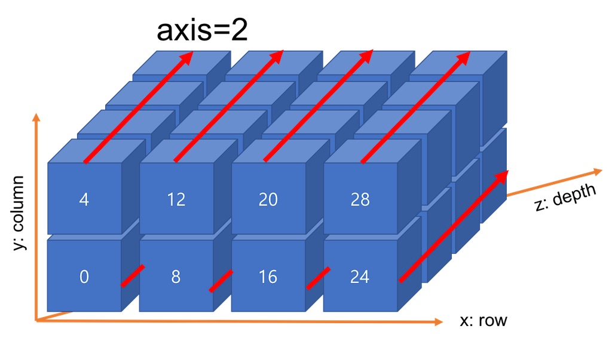

# Numpy

딥러닝을 구현하다보면 행렬 계산이 많이 나온다. 따라서 행렬계산에 특화된 라이브러리라고 볼 수 있다.
Numpy는 여러가지의 method를 가지고 있고, 자주 쓰는 method는 아래와 같다.
- 수치계산에 특화된 matmul, broadcast
- 형태를 바꾸는 flatten, reshape
- 미분계산에 특화된 gradient
- 선형대수를 가지는 linalg 

여기에 다 정리하지 못하는 여러가지 파워풀한 method들이 존재한다. 자세한 method가 궁금하다면 https://numpy.org/ 를 참조하자.
numpy는 앞으로 많이 쓸 pytorch나 tensorflow 안에 내장되어 있으므로 자주 보게 될 것이다. 

 - ## Shape 변환
    
    <code>

        """
        목적 : 행렬의 shape을 변환해주는 기능.
        
        DeepLearning은 layer를 지나면서 layer들에 연결되어있는 weight들을 계산하는 방법으로 학습을 한다.
        이 때, weight들은 모두 Tensor, 행렬들로 이루어져있고, Tensor 행렬들의 계산이다. 
        각 layer와 연결되어있는 weight들, 행렬들이 가지는 shape은 연구자가 자유자재로 변형하기 때문에 shape의 변환에 대해 잘 알아야한다.
        """

        # 1d array
        x = np.array([1.0, 2.0, 3.0])

        # 2d array
        x2 = np.array([[1.0, 2.0, 3.0], [3.0, 4.0, 5.0]])

        # 0.1 간격으로 -5 ~ 5 
        x_arange = np.arange(-5, 5) 
        x_arange = np.arange(-5, 5, 0.1) 

        # 임의의 function 안에 arange(x의 범위 지정) 대입 가능 // 직접 구현한 func도 가능
        def temp_func(arr):
            return np.cos(arra)

        s = temp_func(x_arange)

        # 일정 구간에 점 만들기 (default=50, 숫자를 뒤에 적어주지 않으면 기본값은 50)
        x1 = np.linspace(x[:,0].min(), x[:,0].max()) #p 
        x2 = np.linspace(x[:,1].min(), x[:,1].max()) #q 

        # array.shape, 2가 row, 3이 column
        print(x.shape)
        >>> (3,)
        print(x2.shape)
        >>> (2, 3)

        # array.dim, 차원의 수를 말한다.
        print(x.ndim)
        >>> 1
        print(x2.ndim)
        >>> 2
        
    </code>
- ## Type 확인

    <code>

        """
        목적 : 행렬 안에 element의 숫자 타입 확인해주는 기능  

        아마 tensorflow나 pytorch를 쓰게되면 대부분 float로 이미 되어있을테지만, 그래도 알아두는 편이 좋을 것 
        """
        # array 성분의 data type return
        >>>print(x.dtype)
        float64

        # array 성분의 data type int, float 로 변경 가능. 한 성분만은 불가능
        >>>print(x.astype(int))
        [10, 20]

        # array.reshape
        >>> x_t = x.reshape(1, x.size)
        >>> print(x_t.shape) 
        [1, 2]

    </code>

- ## Broadcast

    <code>

        """
        목적 : 크기가 다른 행렬들의 연산을 가능하게 해주는 기능

        DeepLearning을 하다보면 행렬끼리의 연산을 할 때, 대부분 서로 크기가 다르다. 
        원래 크기가 다른 행렬끼리는 연산이 안되지만, numpy는 크기가 다른 행렬들의 연산을 도와준다.
        """

        # B는 1차원, C는 2차원이여도 똑같이 broadcast 적용된다.
        >>> A = np.array([[1,2], [3,4]])
        >>> B = np.array([[10,20]])
        >>> A*B
        array([[10, 40],
            [30, 80]])
        >>> C = np.array([10,20])
        >>> A*C
        array([[10, 40],
            [30, 80]])

        """
            [[10, 20] * [[3, 3]
            [10, 20]]   [5, 5]]
            로 변환 하여 연산
        """
        >>> a = np.array([10, 20]) # shape = (2,)
        >>> b = np.array([[3],[5]]) # shape = (2,1)
        >>> a*b
        array([[ 30,  60],
                [ 50, 100]])

    </code>

- ## indexing & slicing

    <code>

        """
        목적 : [] 을 이용, 행렬의 element 접근 가능하게 해주는 기능
        """

        >>> x = np.array([1, 2, 3, 4, 5, 6])
        # x[0], x[2], x[4]
        >>> y = x[np.array([0, 2, 4])]
        >>> print(y)
        [1, 3, 5]

        >>> z = np.array([[1, 2, 3, 4, 5, 6], [7, 8, 9, 10, 11, 12]])
        # x[0][1], x[4][5]
        >>> y = z[[0, 1], [4, 5]]
        >>> print(y)
        [5, 12]

    </code>

- ## nditer 
    (출처 : https://github.com/4Moyede/DeepLearning_Basic/blob/main/note/01_numpy.md)

    <code>

        """
        목적 : 반복문 사용 가능하게 해주는 기능
        
        array가 다차원일 때에, for문에서 차례대로 index로 접근이 필요.
        예를 들면, (0, 0), (0, 1), (0, 2), (1, 0), (1, 1) ... 순으로 접근하는 식.
        """

        it = np.nditer(x, flags=['multi_index'], op_flags=['readwrite'])
        while not it.finished:
            idx = it.multi_index # tuple 타입의 (i, j)
            print(A[idx]) # [] 연산자로 접근 가능
            it.iternext()   

    </code>

- ## Axis (None,0,1,2)

    

    axis 개념은 나중에 산술연산할 때, 굉장히 중요한 개념이다. row, column, depth에 따라서 sum, average, subtract 을 할 수 도 있다. 
    - axis=None : all element
    - axis=0 : row
    - axis=1 : column
    - axis=2 : depth

    ### 예제 array 생성
    <code>
    
        >>> arr = np.arange(0, 32)
        >>> len(arr)
        32
        >>> arr
        array([ 0,  1,  2,  3,  4,  5,  6,  7,  8,  9, 10, 11, 12, 13, 14, 15, 16,
            17, 18, 19, 20, 21, 22, 23, 24, 25, 26, 27, 28, 29, 30, 31])
        >>> v = arr.reshape([4,2,4])
        >>> v.ndim      ## v의 차원
        3 

    </code>

    우선 arrage를 사용해서 배열을 만들어준 후, reshape 을 통해 depth=4, row=2, column=4인 array를 만들어주었다.  
    앞으로 CNN이나 여러 아키텍쳐들을 활용하면서 차원의 수가 기하급수적으로 늘어나기 때문에 잘 확인해야한다.

    ## 실제 array
    
    

    ### case 1. axis=None

    <code>

        """
        axis=None은 기본값으로 모든 요소의 값을 합산하여 1개의 스칼라값을 반환합니다.
        """
        >>> v.sum()     
        496

    </code>

    ### case 2. axis=0

    
    

    <code>

        """
        axis=0은 x축을 기준으로 여러 row를 한 개로 합치는 과정입니다.
        """

        >>> res01=v.sum(axis=0)
        >>> res01.shape
        (2, 4)
        >>> res01
        array([[48, 52, 56, 60],
            [64, 68, 72, 76]])

    </code>

    ### case 3. axis=1

    
    

    <code>

        """
        axis=1은 y축을 기준으로 row 별로 존재하는 column들의 값을 합쳐 1개로 축소하는 과정입니다.
        """

        >>> res02=v.sum(axis=1)  ## axis=1 기준 합계
        >>> res02.shape
        (4, 4)
        >>> res02
        array([[ 4,  6,  8, 10],
            [20, 22, 24, 26],
            [36, 38, 40, 42],
            [52, 54, 56, 58]])
    </code>

    ### case 4. axis=2

    
    

    <code>

        """
        axis=2는 z축을 기준으로 column의 depth가 가진 값을 축소하는 과정입니다.
        """

        >>> res03=v.sum(axis=2)  ## axis=2 기준 합계
        >>> res03.shape
        (4, 2)
        >>> res03
        array([[  6,  22],
            [ 38,  54],
            [ 70,  86],
            [102, 118]])
    </code>

    출처 : http://taewan.kim/post/numpy_sum_axis/

## Note

numpy는 복잡한 연산을 빠르게 실행해야하기 떄문에, C/C++로 이루어져있다. 이 때 파이썬은 단지 "중개자" 역힐을 하는 것이다. 
단지 파이썬이 C/C++로 이루어져있는 라이브러리를 불러오기 때문에 성능이 떨어지지 않고 우리가 쓸 수 있는 것이다.